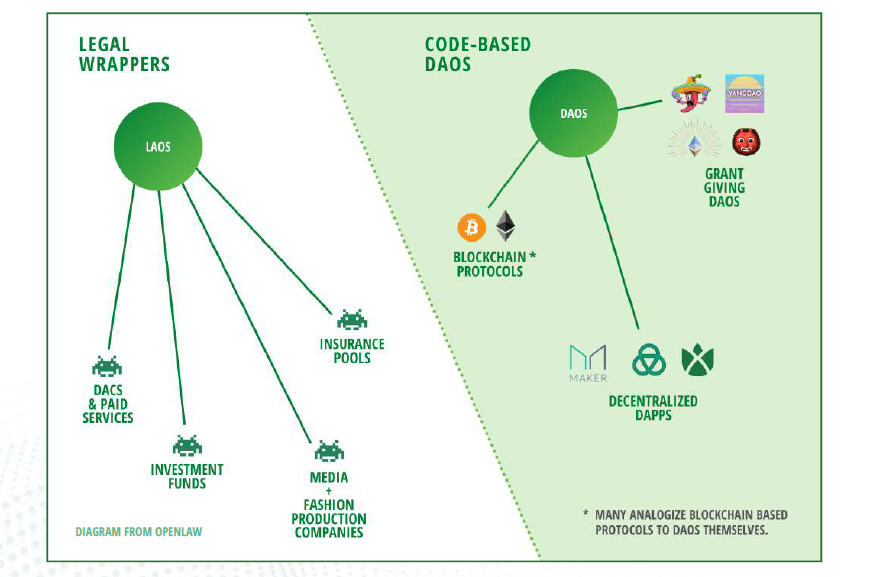

# DAO:A Decentralized Governance Layer for the Internet of Value
# DAO：价值互联网的去中心化治理层
原文作者: George Samman & David Freuden，2020年5月      
译者: blocklee(听风)，2020年7月     

## content

- [简介](#简介)
- [关键要点](#关键要点)
- [什么是DAO？](#什么是DAO？)
- [DAO是一种误称吗？](#DAO是一种误称吗?)
- [DAOs的技术层](#DAOs的技术层)
- [DAOs与分布式金融（DeFI）](#DAOs与分布式金融（DeFI）)
- [DAO的三角对立关系](#DAO的三角对立关系)
- [治理——权力下放](#治理--权力下放)
- [权力下放——个人](#权力下放--个人)
- [个人——治理](#个人--治理)
- [治理](#治理)
- [常见的DAO治理挑战](#常见的DAO治理挑战)
- [DAO仲裁服务](#DAO仲裁服务)
- [DAO和公司](#DAO和公司)
- [最后的想法和结论](#最后的想法和结论)
- [DAO生态系统](#附录)
- [参考文献](#参考文献)

## Authors
- **George Samman**
Website:www.sammantics.com
Email:georgesamman42@gmail.com
Twitter:@george_samman
Linkedin:https://www.linkedin.com/in/georgesamman

  George can be found roaming through the crypto-verse. His current headspace is dedicated to decentralized governance, crypto-finance and investing in the ecosystem.
  乔治漫游于加密世界各处。他目前的顶部空间是致力于去中心化治理、加密金融和投资生态系统。
  

- David Freuden
Website:www.monsterplay.com.au
Email:dfreuden@monsterplay.com.au
Twitter:@MonsterplayAus
Linkedin:https://www.linkedin.com/in/davidfreuden

  David is principal at Monsterplay, working with entrepreneurs and their teams to commercialise and scale their businesses. Since 2016 he has been investing, advising and writing about blockchain and cryptocurrencies.
  大卫是Monsterplay的负责人，与企业家及其团队合作，将他们的业务商业化和规模化。自2016年以来，他一直从事区块链和加密货币的投资、咨询和写作。
  
----------------------------------------

## Acknowledgments 致谢

Sarah Miles, PeterPan, Marie Leaf, Kirill Gourov, Alex Kampa, Alex Masmej, Julien Bouteloup, Kain Warwick, Akseli Virtanen, Mark Roddy, Omar Hannoun, Charlie Smith, Dorjee Sun, Kevin O’Hara, Colin Platt, Daniel Bar, Ron Quaranta, Fran Strajnar, James Zaki,Steven McKie, Matt Prewitt

“Under any economic, social, or political system, individuals, business firms, and organizations in general are subject to lapses from efficient, rational, law-abiding, virtuous, or otherwise functional behavior. No matter how well a society's basic institutions are devised, failures of some actors to live up to the behavior which is expected of them are bound to occur, if only for all kinds of accidental reasons. Each society learns to live with a certain amount of such dysfunctional or misbehavior; but lest the misbehavior feed on itself and lead to general decay, society must be able to marshal from within itself forces which will make as many of the faltering actors as possible revert to the behavior required for its proper functioning.”[1]

“In the place of nation-states you will see at first, smaller jurisdictions at the provincial level, and ultimately smaller sovereignties, enclaves of various kinds like medieval city-states surrounded by their hinterlands. As strange as it may seem to people inculcated with the importance of politics, policies of these new ministates will in many cases be informed more by entrepreneurial positioning than political wrangling. These new, fragmented sovereignties will cater to different tastes, just as hotels and restaurants do, enforcing specific regulations within their public spaces that appeal to the market segments from which they draw their customers.”2

“The view that state improves the functioning of the economy by massive reallocation of resources is an anachronism….it should not be forgotten that governments waste resources on a large scale. Wasting resources makes you poor. A dramatic improvement in the efficiency of resource use will arise when revenues historically engrossed by governments come to be controlled instead by persons of genuine talent.”3

"在任何经济、社会或政治制度下，个人、企业公司和一般组织都有可能出现与高效、理性、守法、良性或其他功能行为相悖的失误。无论一个社会的基本制度设计得多么完善，一些行为者未能达到人们对他们的期望的行为，即使只是出于各种偶然的原因，也必然会发生。每个社会都学会了忍受一定数量的这种功能失调或行为失范；但为了避免行为失范自食其果，导致普遍的衰败，社会必须能够从自身内部调动力量，使尽可能多的失范行为者恢复到正常运作所需的行为。

"在民族国家的位置上，你一开始会看到省一级的小辖区，最终会看到更小的主权国家，像中世纪城邦一样的各种飞地，被其腹地包围。虽然对于那些被灌输了政治重要性的人来说可能会觉得很奇怪，但在很多情况下，这些新的部族国家的政策更多的是通过企业定位而不是政治角力来实现的。这些新的、支离破碎的主权国家将迎合不同的口味，就像酒店和餐馆一样，在其公共空间内执行具体的规定，以吸引其顾客的市场阶层。

"国家通过大规模的资源重新分配来改善经济运行的观点是不合时宜的......不应该忘记，政府大规模地浪费资源。浪费资源会使你变得贫穷。当历史上由政府吞噬的收入转而由真正有才干的人控制时，资源使用效率就会有极大的提高。"

>"Reciprocity is one of the main forms of human sociality and is defined as: cooperation for mutual benefit. The most complex and far reaching examples of reciprocity are market interactions: trading, buying, selling, producing and other economic activities.”
>
> —— Olson,Mancur

>"互惠 "是人类社会性的主要形式之一，它的定义是：互利合作。互惠最复杂、影响最深远的例子是市场互动：交易、买卖、生产和其他经济活动。"
>
>—— 奥尔森、曼库尔(1987)

---------------------------------

1. Hirschman, Albert “Exit, Voice And Loyalty” 1971    
2. Davidson and Moog “The Sovereign Individual”     
3. Olson, Mancur (1987) ‘Diseconomies of Scale and Development’    
   https://www.cato.org/sites/cato.org/files/serials/files/cato-journal/1987/5/cj7n1-5.pdf

---------------------------------

## INTRODUCTION
## 简介

There are many misconceptions around what Decentralized Autonomous Organizations (DAOs) are and their purpose. A DAO at its core is a simplistic organizational structure and governance process that allows for the collective management of common goods which can be economic or non-economic.4 The future of DAOs, while simplistic now, has the potential to re-create and re-shape the way organizations are structured. It is still very early days being barely 4 years (30 April 2016) since the first DAO was launched. This first DAO aimed to operate as a venture capital fund for investing in cryptocurrency projects and was an unexpected success securing 12.7M Ether (worth $USD 250M at the time). The space has seen significant development and growth since then and has subsequently sprouted many DAOs and seen a broadening in the scope of use cases. This growth is producing a fertile platform for learning, evolution and various forms of adoption.

There are many definitions, assumptions and new terminologies associated with DAOs, and they vary significantly depending on which group you are communicating with. That being said, one of the key assumptions that still warrants clarification is the relationship between decentralized and centralized organizational frameworks. These frameworks are not static points at opposite ends of a spectrum. Rather, the different functions of an organisation operate on a centralization scale.

Another interesting development is how blockchain technology is becoming a platform for capital formation. Decentralized finance uses applications built on open, public blockchains (like Ethereum or Bitcoin) to facilitate financial services to anybody, anywhere without the need for traditional financial intermediaries. Cryptocurrencies and digital assets can be moved directly within the DAO itself. While DAOs have been discussed and experimented with for the last four years, only now have they become the logical extension of the capital formation piece. This extension was first realized with Ethereum and MakerDao,5  which was one of the first DAOs and Decentralized Finance (DeFi) projects to be built on Ethereum. Decentralized Finance (DeFi) has the potential to spur growth in the formation of DAOs, particularly investment/for-profit DAOs. Despite the potential that DAOs present, they face challenges from legal, governance and security perspectives.

DAOs are as diverse as humanity itself. There are many different categories and feature sets. However, there is one key similar feature amongst DAOs: the collective management of common goods via decentralized governance. The opportunities ahead will be in the formation of new types of organizations based around the interactions between token holders and decentralized governance. 

DAOs make interaction, collaboration, revenue sharing and risks (organization, community) programmable for the first time. This is allowing for an entirely new design space. The first generation internet protocols were stateless (like HTTP) so they needed a data layer for any application functionality. The organization of the “state” of the data layer was provided by the winners of yesterday: Google(for search), Facebook (for social), eBay (for commerce). This allowed them to capture value and drive centralization of the internet. But now the value capture model based on centralized control of the data layer is becoming obsolete: one can not have a competitive advantage based on control of data anymore when we know how to keep a "state" in a decentralized way. Alternatives are now available for people to govern themselves, belong, interact, participate, share ownership, create value, take risks and invest together. The structure of a DAO and the way the community comes together forms the value creation layer.

围绕着什么是分散式自治组织(DAO)及其目的，人们有很多误解。DAO的核心是一种简单化的组织结构和治理过程，它允许集体管理共同的物品，这些物品可以是经济的，也可以是非经济的4。 DAO的未来虽然现在很简单，但有可能重新创造和重塑组织的结构方式。自第一个DAO启动以来，距离仅仅4年（2016年4月30日）的时间，现在还处于非常早期的状态。这第一个DAO旨在作为投资加密货币项目的风险投资基金来运作，并取得了意想不到的成功，获得了1270万以太币（当时价值2.5亿美元）。从那时起，该领域得到了显著的发展和增长，随后萌生了许多DAO，并看到了用例范围的扩大。这种增长正在产生一个肥沃的学习、进化和各种形式的采用平台。

与DAO相关的定义、假设和新的术语有很多，而且根据你与哪个群体交流，它们有很大的不同。尽管如此，其中一个关键的假设仍然值得澄清，那就是分散式组织框架和集中式组织框架之间的关系。这些框架并不是处于光谱两端的静态点。相反，一个组织的不同职能是在集中化的范围内运作的。

 另一个有趣的发展是区块链技术如何成为资本形成的平台。去中心化金融使用建立在开放的公共区块链（如Ethereum或比特币）上的应用程序，为任何人、任何地方提供便利的金融服务，而不需要传统的金融中介机构。加密货币和数字资产可以直接在DAO本身内移动。虽然DAO在过去四年里一直在讨论和实验，但直到现在才成为资本形成这一块的逻辑延伸。这种延伸最早是在Ethereum和MakerDao上实现的，它是第一批建立在Ethereum上的DAO和去中心化金融（DeFi）项目之一。去中心化金融（DeFi）有可能刺激形成DAO的增长，特别是投资/盈利性DAO。尽管DAO具有潜力，但它们面临着法律、治理和安全方面的挑战。

DAO就像人类本身一样多种多样。有许多不同的类别和特征集。然而，DAO之间有一个关键的相似特征：通过分权治理对共同物品进行集体管理。未来的机会将是围绕代币持有者和分散式治理之间的互动而形成的新型组织。

DAO第一次让交互、协作、收益分享和风险（组织、社区）可编程。这是一个全新的设计空间。第一代互联网协议是无状态的（如HTTP），所以它们需要一个数据层来实现任何应用功能。数据层的 "状态 "的组织是由昨天的赢家提供的。Google（搜索）、Facebook（社交）、eBay（商务）。这使得他们能够获取价值，推动互联网的中心化。但现在，基于数据层中心化控制的价值获取模式已经过时了：当我们知道如何以去中心化的方式保持 "状态 "的时候，就不可能再有基于数据控制的竞争优势了。现在，人们可以有替代方案来管理自己、归属、互动、参与、分享所有权、创造价值、承担风险和共同投资。DAO的结构和社区聚集的方式构成了价值创造层。

--------------------
4. These can be political systems, donations, cultural works, natural resources, investing, lending etc.    
5. https://makerdao.com/en/whitepaper

---------------------

## KEY TAKE-AWAYS
## 关键要点

- The key feature that changed organizations over the years has been: reducing transaction costs to coordinate. This is reflected in Coase’s Theory of the Firm. You can achieve marginal improvements, such as applying decision support systems within an organization, but every once in a while, a large systemic change occurs that at first looks like a marginal benefit, but in essence enables wholly new types of organizations to exist.
  
- DAOs not only allow for the reduction of transaction costs, but new organizational forms and compositions to be created.

- In order to have a highly functional DAO, members must:
  - Have equal access to the same information for decision-making
  - Face the same costs for transacting their preferred choices
  - Base their decisions on self-interest and the best interest of the DAO (not on coercion or fear)
  
- DAOs attempt to solve coordination problems by solving problems associated with collective actions by aligning individual incentives with globally optimal outcomes (for people or corporations). By pooling funds and voting on fund allocation, stakeholders share the costs and incentivize coordination so the entire ecosystem benefits.

- DAOs are performing the biggest experiment in new forms of alternative governance. These experiments are not in the form of giant nation-states but applied on a local community level. This comes at a time where peak globalization is in the rear-view window and the world is retreating to a more local model.

- It is important to note, Bitcoin was the first DAO. It is run without a central authority by a core team of developers who propose decisions on the future direction of the project, mainly through Bitcoin Improvement Proposals (BIPs) which need consensus from all network participants (though mainly miners and exchanges) for changes in the code to be made.

- There will be a growing number of DSaaS (DAO Software as a Service) providers, such as OpenLaw, Aragon and DAOstack, designed to accelerate the growth of DAOs as a category. They will provide on-demand specialized resources such as legal, accounting, and third party auditing for compliance services.

- In a DAO a triangle of tensions exists. This lexicon of the triangle is based on the treatise “Exit, Voice & Loyalty” by Albert Hirschman. These must be balanced to find an optimal outcome which allows the DAO to achieve its mandate:
  - Exit (Individual)
  - Voice (Governance)
  - Loyalty (Decentralization)

- 这些年来，改变组织的关键特征是：降低协调的交易成本。这在科斯的《公司理论》中得到了体现。你可以实现边际改善，比如在组织内部应用决策支持系统，但每隔一段时间，就会发生一次大的系统性变革，起初看起来像是边际效益，但从本质上讲，它使全新的组织形式得以存在。
  
- DAO不仅可以降低交易成本，而且可以创造新的组织形式和组成。

- 为了拥有一个高功能的DAO，成员必须。
  - 平等地获得相同的决策信息
  - 面对同样的成本来处理他们喜欢的选择
  - 以自身利益和DAO的最大利益为基础做出决定(而不是以胁迫或恐惧为基础)；

- DAO试图通过解决与集体行动相关的问题来解决协调问题，使个人激励与全局最优结果（对人或企业而言）保持一致。通过汇集资金并对资金分配进行投票，利益相关者分担成本并激励协调，从而使整个生态系统受益。  

- DAO正在以一种可替代的新的治理形式进行一项伟大的试验。这些实验不是以巨大的民族国家的形式，而是应用在地方社区层面。这是在全球化高峰期已经过去，世界正在向更加地方化的模式撤退的时候出现的。

- 需要注意的是，比特币是第一个DAO。它是在没有中央权威机构的情况下运行的，由一个核心的开发者团队对项目未来的发展方向提出决策建议，主要是通过比特币改进提案（BIPs），需要所有网络参与者（虽然主要是矿工和交易所）达成共识，才能对代码进行修改。

- 将会有越来越多的DSaaS（DAO软件即服务）提供商，如OpenLaw、Aragon和DAOstack，旨在加速DAO这个类别的发展。他们将提供按需的专业资源，如法律、会计和第三方审计的合规服务。

- 在一个DAO中，存在一个三角对立关系。这个三角关系的词汇是基于Albert Hirschman的论文 "Exit, Voice & Loyalty"。必须平衡这些因素，以找到一个最佳结果，使DAO能够实现其任务。
  - 叛离（个人）
  - 抗议（治理）
  - 忠诚度(权力下放)

- DAOs challenge the traditional hierarchical and exclusive organizational structure as seen in many facets of the world today. Through “wisdom of the crowds” it is possible to have better collective decision making and therefore better-run organizations.

- New products are being made at the intersection of DAOs and Decentralized Finance6 (DeFi). As DAOs become more decentralized and digitized using DeFi products as the payment/distribution methods, DAOs will increase and lead to new and more DeFi products being formed to interact with DAOs. This will be most powerful where the DeFi implementations allow the token holders to use governance to customize and optimize the design of the parameters of the application creating a better, tailored user-experience. It can also be used for time locking and creating different types of fee structures.

- DAOs allow for capital to be pooled, that pooled capital to be allocated and to create an asset-backed by that capital. They also allow for non-financial resource allocation. 

- Using DeFi enables DAOs to bypass, if they choose, the traditional banking sector, along with their inefficiencies. This is significant as it creates a Trustless, Borderless, Transparent, Accessible, Interoperable & Composable7 corporation.

- DAO community and governance is very complex and difficult to get right, yet is crucial to the success of the DAO. Coordination processes and incentive measures need to be balanced so that all community members feel that their contributions matter.

- Many DAOs will be looking to wrap a legal structure with underlying smart contract code around the entity so as to comply with regulations, provide legal protection and limited liability to their participants and allow for easier deployment of capital.

- DAO is a Misnomer. DAOs today are not fully decentralized, nor are they fully autonomous and in some cases, they may never aspire to be either. Most DAOs will start centralized, then start adopting smart contracts to automate simple internal processes and limit centralized governance. With an aligned purpose, good design, and luck they can grow towards being a truer version of a DAO in time.This misnomer has led to a lot of hype around the distributed autonomy of DAOs versus the reality of what they are today.

- DAOs are not radical or unique to blockchain technology. There is a long history of DAOs to improve governance structures, decentralized decision making, improve and enforce transparency, and enable membership voting and active participation in decision making.

- DAO participation currently targets a niche within a niche within a niche. Many DAOs require minimum staking for participation in a cryptocurrency. This limits participation to the crypto participants who are wealthy, tech-savvy enough, and interested enough to participate in a DAO.

- DAO挑战的是传统的等级制和排他性的组织结构，这在当今世界的许多方面都可以看到。通过 "众人的智慧"，可以有更好的集体决策，从而有更好的组织运行。

- 在DAO和去中心化金融6（DeFi）的交叉点上，新的产品正在诞生。随着使用DeFi产品作为支付/分配方式的DAO变得更加分散和数字化，DAO将增加，并导致新的和更多的DeFi产品被形成，以与DAO互动。这将是最强大的地方，DeFi实现允许代币持有者使用治理来定制和优化应用的参数设计，创造更好的、量身定制的用户体验。它还可以用于时间锁定和创建不同类型的收费结构。

- DAO允许汇集资本，对汇集的资本进行分配，并创建由该资本支持的资产。它们还允许进行非金融资源分配。

- 使用DeFi使DAO能够绕过传统的银行部门，以及他们的低效率，如果他们选择的话。这一点非常重要，因为它创造了一个无信任、无边界、透明、可访问、可互操作和可组合的公司。7

- DAO社区和治理是非常复杂和难以做好的，但对DAO的成功至关重要。协调过程和激励措施需要平衡，以使所有社区成员感到他们的贡献很重要。

- 许多DAO将寻求在实体周围包裹一个带有底层智能合约代码的法律结构，以便遵守法规，为其参与者提供法律保护和有限的责任，并允许更容易地部署资本。

- DAO是一个误称。今天的DAO并不是完全去中心化的，也不是完全自治的，在某些情况下，它们可能也永远不会渴望成为这样的组织。大多数DAO会从中心化开始，然后开始采用智能合约来自动化简单的内部流程，限制中心化治理。如果有一个一致的目的，良好的设计和运气，他们可以在一段时间内成长为一个更真实的DAO版本.这个错误的名称导致了围绕DAO的分布式自治与今天的现实进行了大量的炒作。

- DAO不是激进的，也不是区块链技术所独有的。DAO在改善治理结构、去中心化决策、提高和执行透明度、实现会员投票和积极参与决策方面有着悠久的历史。

- DAO参与目前针对的是小众中的小众。许多DAO要求参与加密货币的最低赌注。这就限制了那些有钱、懂技术、有兴趣参与DAO的加密参与者的参与。

----------------------------------
6. Decentralized finance uses applications built on open, public blockchains (like Ethereum) to facilitate financial services to anybody, anywhere.     
7. Creating services with other existing projects by plugging existing projects into your project.

-----------------------------------

## WHAT IS A DAO?
## 什么是DAO？

A Decentralized Autonomous Organization (DAO) is an organization where the rules of operation and organizational logic are encoded as a smart contract on a blockchain. The characteristics of a DAO are decentralization, transparency, and independence. The end goal is non-centrally controlled decision making and governance8. Note that the rules of operation can include mechanisms to change the rules themselves.

DAOs are currently formulated as a cross-section of a real-world and digital corporation. This formulation combines blockchain technology, organizational structures, legal entities, workflow execution, governance/voting, incentive structures, and contribution/work. Their decentralized and autonomous elements create the opportunity to realign, streamline and automate organizational structure and operational requirements such as governance, voting, asset/wealth distribution, membership/participation, participant contribution, incentives, financial and legal contracts.

DAOs can also be described as an entity that lives on the internet and exists autonomously. Something (be it record keeping, policy voting, and/or money management) must happen on-chain, or at least through some kind of smart contract(s). For example, driverless cars using toll roads could pay fees, automatically schedule and pay for servicing, or even operate as an Uber collecting fees and deriving revenue.

A DAO is essentially a composition of smart contracts built on decentralized infrastructure. Smart contracts are simply programmable transactions.9 DAO transactions are programmed to execute when the majority of the voters (voters who hold tokens) find consensus and a pre-programmed outcome is activated as a result of the consensus. DAOs may program different voting thresholds for triggering an action or outcome. (e.g. 75% need to agree not just a 50/50 split, or differing levels of quorum in order to pass voted actions.)

去中心化自治组织(DAO)是一种组织，其运作规则和组织逻辑被编码为区块链上的智能合约。DAO的特点是去中心化、透明和独立。最终目标是非中心化控制的决策和治理8。需要注意的是，操作规则可以包括改变规则本身的机制。

DAO目前的表述是现实世界和数字公司的交叉。这种表述结合了区块链技术、组织结构、法律实体、工作流执行、治理/投票、激励结构和贡献/工作。它们的去中心化和自治元素创造了重新调整、简化和自动化组织结构和运营要求的机会，如治理、投票、资产/财富分配、成员/参与、参与者贡献、激励、财务和法律合同。

DAO也可以被描述为一个生活在互联网上并自主存在的实体。一些事情（无论是记录保存、政策投票和/或资金管理）必须在链上发生，或至少通过某种智能合约。例如，使用收费公路的无人驾驶汽车可以支付费用，自动安排和支付服务费用，甚至像Uber一样收取费用并获得收入。

DAO本质上是建立在去中心化基础设施上的智能合约的组成。智能合约就是简单的可编程交易9，DAO交易被编程为当大多数投票者（持有代币的投票者）发现共识时执行，并因共识而激活一个预先编程的结果。DAO可以编程不同的投票阈值来触发行动或结果。(例如，需要75%的人同意，而不仅仅是50/50的比例，或不同的法定人数水平，以通过表决的行动。)

-------------------------
8. One of the main benefits of Ethereum is that it enables a community of strangers to pool value together and execute on their shared goals with less need for trust or organizational overhead. Disparate groups of people online can organize by relying on the predictability of blockchain-based “smart contracts” to execute on their group decisions and transfer value according to hard-coded rules in a highly “tamper proof” digital environment. [From OpenLaw]

9. For a comprehensive overview of smart contracts see:
   https://bitsonblocks.net/2016/02/01/gentle-introduction-smart-contracts/

----------------------------

#### Differences
#### 差异性

Let's first focus on the features that make a DAO different from traditional organizations. The first difference is the fact that the rules are housed within an immutable computer program. The advantage is that the rules cannot be easily changed, only upgraded, making it resistant to direct attacks on the governance rules. History has shown that one of the ways a democratic country can shift towards dictatorship is by perverting the rules of democracy. A DAO aims to solve these problems but is not there yet. For example, some dictators have been elected or given powers democratically - even Hitler ascended to be Chancellor of Germany through the democratic process. This would also be possible in a DAO as they are presently constructed.

There are also downsides and risks to this, including:
- The program could include bugs.
- Except for simple organizations, it is not easy to write rules that reflect the complexity that characterizes human decision-making.
- There is some rigidity in the system, for example, in unforeseen situations rules cannot be quickly changed.
- Code compatibility can be an issue as new code is added with the evolution of DAOs
  
Note, however, that in the same way as no democratic system is resistant to dictatorship, no DAO is resistant to a change of rules that would essentially give control of the DAO to one person or entity. An example of this has been the global response to COVID-19, where many nation-states have moved to states of exception. In the case of Hungary, the Prime Minister, Victor Orban used the situation to introduce a special state of powers where he will govern by decree for an indefinite period of time. All it takes is a sufficient majority of stakeholders to game the voting process or exploiting/deploying malicious code. Another issue is that the voters will not always be experts in the subjects they are voting on which could lead to poor decisions compared to trusting those decisions to be made (still with governance in place) by executives who have deep subject matter expertise.

Another difference is the decision-making process in centralized versus decentralized corporations. In centralized organizations, decision making power is delegated to a few elected individuals (e.g. board or politicians) governed by a traditional governance system (e.g. separation of powers) In decentralized organizations, decision making is distributed and power is given to all interested parties (e.g. shareholders) as governed by pre-defined rules that exist on decentralized infrastructure.

让我们首先关注一下使DAO不同于传统组织的特点。第一个不同之处是，规则被安置在一个不可改变的计算机程序中。其优点是规则不能轻易改变，只能升级，这就使得它能抵御对治理规则的直接攻击。历史表明，一个民主国家转向独裁的方式之一，就是歪曲民主规则。DAO旨在解决这些问题，但目前还没有达到这个目的。例如，一些独裁者是通过民主选举或赋予权力的--甚至希特勒也是通过民主程序成为德国总理的。在目前构建的民主发展组织中，这也是可能的。

这里也有缺点和风险，包括： 

- 程序可能会有bugs。
- 除了简单的组织，要写出反映人类决策复杂性特点的规则是不容易的。
- 系统有一定的刚性，例如，在不可预见的情况下，规则不能迅速改变。
- 代码兼容性可能是一个问题，因为随着DAO的发展，新的代码不断增加。

然而，请注意，正如任何民主制度都无法抵御独裁一样，没有一个DAO能够抵抗规则的改变实质上是将DAO的控制权交给一个人或实体。这方面的一个例子是全球对COVID-19的反应，许多民族国家已经转为异常状态。在匈牙利，总理 Victor Orban 利用这种情况推出了一种特权状态，他将通过法令无限期地进行执政。所需要的是足够多的利益相关者参与投票过程或利用/部署恶意程序。另一个问题是，相比于信任那些由拥有深厚专业知识的高管（仍在治理中）做出的决策，选民并不总是他们所投票的领域的专家，这可能导致糟糕的决策。

另一个区别是集权式公司与分权式公司的决策过程。在集权式组织中，决策权被授予少数经选举产生的个人(如董事会或政治家)，由传统的治理制度(如分权)来管理。 在分权式组织中，决策权被打散，权力被赋予所有相关方(如股东)，由存在于分权式基础设施上的预定规则来管理。

#### Anonymity
#### 匿名性

Depending on the blockchain, DAO “shareholders” may be able to remain anonymous or pseudonymous. Some proponents have seen that as an advantage, protection from influence from each other or to prevent factions from occurring. Some participants may also want to remain anonymous due to privacy concerns from certain entities (e.g. government authorities). The downside is legal uncertainty, de facto impossibility to enter into contractual agreements. Another risk is one person or entity secretly gaining control of the DAO (e.g. a potential Sybil attack).

依赖于区块链的特性，DAO 的"股东"可能会保持匿名或假名。一些支持者认为这是一种优势，可以保护自己不受对方的影响，或防止派别的发生。一些参与者也可能因为某些实体（如政府当局）的隐私考虑而希望保持匿名。缺点是法律上的不确定性，事实上不可能签订合同协议。另一个风险是一个人或实体秘密获得对DAO的控制权（如潜在的 Sybil 攻击）。

#### Similarities
#### 相似性

In the end, any organization is run by humans, and this applies for the governance of DAOs also. Because human decision-making is typically very complex, encoding this into formal rules is difficult, if not impossible. In other words, even in a DAO most of the decision process will be done off-chain anyway. Think of a democracy, and compare the time spent in debates and discussions to the time spent actually voting. The hope that by encoding an organization’s governance in blockchain smart contracts this will magically solve governance problems was, of course, an illusion. This is not the only issue with DAOs. In contrast with the world-changing ambitions of blockchain / DAO enthusiasts, the governance rules that have been developed for DAOs so far are generally rather simple and lack significant innovation. DAOs are the first iteration of the transition to a programmable medium for both organizations and the economy. Over time this will allow for a greater heterogeneity of organizational and economic structures.

As governance and technology evolve one can be certain that the DAO of today will be very different from the DAO of tomorrow. As DAOs grow and become more common and accepted outside of just the blockchain ecosystem, they may also impact existing organizations as they may see a DAO as a mechanism to improve their own governance and stakeholder engagement.

归根结底，任何组织都是由人管理的，这也适用于发展DAO组织的治理。由于人的决策通常是非常复杂的，将其编码为正式的规则是困难的，甚至是不可能的。换句话说，即使在DAO中，大部分的决策过程也会在链外完成。想一想民主制度，比较一下辩论和讨论的时间与实际投票的时间。希望通过将一个组织的治理编码在区块链智能合约中，这将神奇地解决治理问题，当然，这只是一种幻想。这不是DAO的唯一问题。与区块链/DAO爱好者们改变世界的雄心壮志相比，迄今为止为DAO制定的治理规则普遍比较简单，缺乏重大创新。DAO是组织和经济向可编程媒介过渡的第一次迭代。随着时间的推移，这将使组织和经济结构更加异质化。

随着治理和技术的发展，可以肯定的是，今天的DAO将与明天的DAO截然不同。随着DAO的发展，并在区块链生态系统之外变得更加普遍和被接受，它们也可能会影响现有的组织，因为它们可能会将DAO视为改善自身治理和利益相关者参与的机制。

1) **Tech-Related Developer Grants**: These DAOs give grants to teams building out technology and infrastructure on existing platforms. They incentivize developers to build out projects to improve existing protocols/organizations.
2) **Non-Tech Grants**: Giving out grants for social, economic, political and community-based activities.
3) **Investment DAOs (for-profit)**: DAOs that invest capital into projects.
4) **Decentralized Governance**: These companies are specifically working on building out tools and infrastructure to enable decentralized governance capabilities to be built into DAOs.
5) **DDeFI DAOs (for-profit)**:These DAOs are building out different parts of the Decentralized Finance stack aka “money legos”.
6) **Protocols / Organizations**:These are the underlying protocols DAOs are being built on top of. Organizations/Companies are also creating DAOs for token holders.
7) **DSaaS (DAO Software as a Service)**:Software platforms that provide infrastructure to build out DAOs.

_Copyright © 2020 George Samman and David Freuden_

## IS DAO A MISNOMER?
## DAO是一种误称吗？

For a DAO to be created it requires human decision-making to identify the opportunities, validate the need, possibly find co-collaborators, and to map out the processes that can be automated and built into smart contracts. These are all activities of centralized 10 or distributed teams as coordination, contribution, and communication are key elements to building a DAO.

要创建一个DAO，就需要人的决策，以确定机会，验证需求，可能找到共同合作者，并规划出可以自动化和建立在智能合约中的流程。这些都是集中式10或分布式团队的活动，因为协调、贡献和沟通是建立DAO的关键要素。

####How do you bootstrap a decentralized system without being in charge  
——DAO Founder:Christoph Jentzsch - AraCon 2019

####如何在不用全面负责的情况下引导一个去中心化的系统？
——DAO 创始人：Christoph Jentzsch - AraCon 2019

Other centralized elements:
- Nearly every DeFi smart contract that's capable of holding your funds has an admin key. Some of those admin keys can be used maliciously if they fall into the wrong hands. It's very hard to find out how these keys are protected - some products that live on the blockchain have a kill function, while others have a pause function or a master key to stop and making it difficult from the onset to decentralize. By design, others may disable such functionality after a period (incremental decentralisation), or library contracts.
- The protocol should only be upgraded through the consensus of representative stakeholders. The original team which developed the protocol should not be able to arbitrarily upgrade the logic of the smart contracts.
- A DAO must have a source of funds and a process for allocating those funds for development in a way which is secure.

One of the most interesting and pertinent questions is whether or not DAOs can be integrated into traditional business models to improve operations, reduce operational costs and timeframes, create transparency and streamline automated processes that require transparency. This approach and direction bring with it many challenges, including the logistics of how to decentralize with controlled risk, defining what decentralization means to this specific organization and the scale and speed that this decentralization will take. These decisions are made by a centralized body. There are examples of entities with DAO-like structures that have operated successfully, albeit not with technological structures and benefits of DAOs, these include Coop Unions, Credit Unions, Guilds and even the Green Bay Packers, a publicly held non-profit corporation that owns the Green Bay Packers football franchise of the National Football League (NFL).

其他集中的要素：

- 几乎每一个能够持有你资金的DeFi智能合约都有一个管理密钥。其中一些管理密钥可能会被恶意使用，如果他们落入坏人之手。很难找出这些密钥是如何被保护的——一些存在于区块链上的产品具有终止功能，而另一些产品则具有暂停功能或主密钥来停止，从一开始就很难分散。根据设计，其他产品可能会在一段时间后禁用这种功能（增量去中心化），或者库合同。

- 协议应该通过有代表性的利益相关者的共识才能升级。开发协议的原团队不应该能够任意升级智能合约的逻辑。

- DAO必须有一个资金来源，以及以安全的方式分配这些资金用于开发的程序。

最有趣和相关的问题之一是dao是否可以集成到传统的业务模型中，以改进操作、降低操作成本和时间框架、创建透明度并简化需要透明度的自动化流程。这种方法和方向带来了许多挑战，包括如何在风险可控的情况下下放权力，界定权力下放对这一特定组织意味着什么，以及这种权力下放将采取的规模和速度。这些决定是由一个中央机构作出的。有一些具有类似DAO结构的实体成功运作的例子，尽管它们没有DAO的技术结构和好处，这些例子包括合作社联盟、信用社、行会，甚至包括绿湾包装工队，这是一家上市的非营利性公司，拥有美国国家橄榄球联盟（NFL）绿湾包装工队的特许经营权。

Because of this centralized to decentralized approach, the definitions around the decentralized component varies greatly DAO to DAO, subsequently, the ease and adoption of greater decentralization is still a long way from becoming a reality.

The construct of Autonomous (in DAO) is challenging, as the definition begets the question, Autonomous from whom? Organizations still need to operate within the legal framework of jurisdictions of its own structure, as well as the jurisdiction of its participants and members. For example, when a not-for-profit employs people, those people are required to pay the tax within the jurisdiction in which they are citizens. There is also evolving SEC (or other financial regulatory body) guidance on whether governance or operational tokens will be defined as securities, currencies, or commodities. This varies greatly as different DAOs need to prove a certain threshold of decentralization.

Many DAO standards are more iterative than revolutionary. They wish to maintain existing legal and social structures of organizations and implement blockchain for transparency-related tasks such as record keeping, yet still maintain the capacity to use traditional methods if required. From a technological standpoint, DAO forks are also an iterative approach which allow members to take existing code and use it for their expressed purposes in building a DAO which is different from the original DAO. An example of this is Moloch DAO.11 The code has been forked by other DAO’s in the Ethereum ecosystem.12 Other smart contract platforms like Kadena have upgradeable code. Pact, which is Kadena’s smart contract language is non-Turing complete (no recursive attacks)13 and includes formal verification14 of the code which allows for correctness in the code to be found before smart contracts go live. These iterative technological approaches introduce the transparency and trust layers of blockchain and DAO into an organization’s corporate structure but do not necessarily reduce the legal and technical costs of developing DAOs, nor remove jurisdictional and legal uncertainty.

由于这种从集中到分散的方法，围绕分权部分的定义在DAO到DAO之间有很大的差异，因此，距离更大程度的分权变得容易和被采用,仍然还有很长的路要走。

自治（在DAO中）的构建是具有挑战性的，因为该定义产生了一个问题：自治来自谁？各组织仍然需要在其自身结构的司法管辖区以及其参与者和成员的管辖权的法律框架内运作。例如，当一个非营利组织雇用人员时，这些人必须在其公民管辖范围内缴纳税款。此外，美国证券交易委员会（或其他金融监管机构）也在就治理或运营代币是否定义为证券、货币或商品制定指导意见。由于不同的DAO需要证明一定的去中心化门槛，这一点差别很大。

许多DAO标准更多的是迭代而不是革命性的。他们希望维持组织现有的法律和社会结构，并实施区块链以执行与透明度相关的任务，如记录保存，但仍保持在需要时使用传统方法的能力。从技术的角度来看，DAO分叉也是一种迭代的方法，允许成员获取现有代码并将其用于其表达的目的，从而构建与原始DAO不同的DAO。Moloch DAO11就是一个例子。该代码已经被Ethereum生态系统12中的其他DAO所分叉。其他智能合约平台，如Kadena，也有可升级的代码。Pact是Kadena的智能合约语言，它是非图灵完备的（没有递归攻击）13，并且包括对代码的正式验证14，允许在智能合约生效之前发现代码的正确性。这些迭代的技术方法将区块链和DAO的透明度和信任层引入组织的企业结构中，但并不一定能降低开发DAO的法律和技术成本，也不能消除管辖权和法律的不确定性。

---------------------
10. https://bzx.network/blog/introducing-bzxdao

11. https://concourseopen.com/blog/moloch-dao-explained/

12. It’s important to note this not only applies to DAOs. See the recent Steemit/Hive fork. Hive forked from Steemit after the takeover. The community left Steemit to form Hive. https://hackernoon.com/inside-trons-steem-takeover-attempt-and-the-birth-of-the-hive-blockchain-ya1g63249

13. Note: This how the DAO was hacked.

14. https://runtimeverification.com/blog/how-formal-verification-of-smart-contracts-works/

---------------------

## TECHNOLOGY LAYER FOR DAOs
## DAO的技术层

The Base Layer used for DAOs is based on blockchain technology provided by protocols like but not limited to Ethereum, EOSDac (decentralized autonomous corporation), Tezos, Cosmos, Decred, Dash, Enigma and Colony to name a few. At the platform level, you have companies like Aragon and DAOstack which use solidity and can be considered DSaaS (DAO software as a service) models. DAOs built using Aragon and DAOstack sit at application level. It is important to note that you don’t need to use Aragon or DAOstack to build DAOs and that you can fork existing DAOs to create a specific DAO for your needs.

**he diagram below shows how The DAO ecosystem is built using Ethereum.**

Other technology pieces for DAOs come from the underlying protocol (but can be forked) such as the core consensus mechanism and Improvement Proposals/software upgrades. Synthetix is taking a slightly different approach to this problem, they are deploying “governance by exception” approach.15

Governance by exception appoints a council of experts to manage protocol upgrades but allows tokenholders to veto any specific change. This approach focuses on protocol iteration as being critical in the early stages of development. Synthetix is working on this structure with Aragon.

DAOs exist as part of the Layer 2 ecosystem built on top of Ethereum as an example.
See the image below:

DAO使用的基础层是基于协议提供的区块链技术，如但不限于Ethereum、EOSDac（去中心化自治公司）、Tezos、Cosmos、Decred、Dash、Enigma和Colony等。在平台层面，你有像Aragon和DAOstack这样的公司，它们使用solidity，可以被认为是DSaaS（DAO软件即服务）模式。使用Aragon和DAOstack构建的DAO处在应用层面。需要注意的是，你不需要使用Aragon或DAOstack来构建DAO，你可以fork现有的DAO来创建一个特定的DAO来满足你的需求。

**下图显示了如何使用以太坊构建DAO生态系统。**

DAO的其他技术部分来自底层协议（但可以分叉），比如核心共识机制和改进提案/软件升级。Synthetix对这个问题采取了一种稍微不同的方法，他们正在部署 "异常（exception）治理 "的方法15。

异常（exception）治理任命一个专家委员会来管理协议升级，但允许代币持有人否决任何具体的变化。这种方法侧重于协议迭代，因为在开发的早期阶段，协议迭代是至关重要的。Synthetix正在与Aragon一起研究这种结构。

以Ethereum为例，DAO是作为建立在Ethereum之上的第二层生态系统的一部分而存在的。

见下图：

------------------
15. https://github.com/Synthetixio/SIPs/issues/98

16. McKie, Steven ‘The Year of the DAO Comeback’ (2019)
    https://medium.com/amentum/the-year-of-the-dao-comeback-9c888b44980
    
_governance by exception,异常治理，应该是指针对一些异常的、非一般性的状况进行的治理_ 

------------------

## DAOs AND DECENTRALIZED FINANCE (DeFI)
## DAOs与分布式金融（DeFI）

Decentralized finance uses applications built on open, public blockchains (like Ethereum or Bitcoin) to facilitate financial services to anybody, anywhere without the need for traditional financial intermediaries. Cryptocurrencies and digital assets can be moved directly within the DAO itself. This is accomplished through a feature called composability (aka money legos). Composability allows for protocols and applications to be selected and assembled in combinations. An example is how Ethereum is a protocol which MakerDAO, another protocol, is built on top of. MakerDAO is used by many other DeFi applications and those applications use others themselves. DAOs are using these pieces for the treasury function and network value transfer.

The two core pieces that make DeFi flourish in networks are liquidity and collateral. Liquidity is about the state, the banking system it superintends, and the money it issues. DeFi challenges the centrality of the states and the banking system as the source of money issuance, proposing instead p2p reciprocal issuance amongst agents in a network. In normal times, free markets determine what is acceptable as collateral and what is not, and how they can be utilized for leverage. A worker’s primary asset is their capacity to work and earn money. In the context of work, the employer (owner) can use the worker as collateral; yet the worker cannot use themselves as collateral. The collateral question is the financial version of ‘class’. In DAO+DeFi compositions, all agents can issue assets to be used as collateral.

去中心化金融使用建立在开放的公共区块链（如Ethereum或比特币）上的应用程序，为任何人、任何地方提供便利的金融服务，而不需要传统的金融中介机构。加密货币和数字资产可以直接在DAO本身内移动。这是通过一种称为可组合性（又称货币乐高）的功能来实现的。可组合性允许选择协议和应用，并进行组合组装。一个例子是Ethereum是如何作为一个基础协议，令MakerDAO、以及其他协议建立在其之上。MakerDAO被许多其他DeFi应用使用，这些应用本身也使用其他应用。DAO证是使用这些组件来实现财政功能和网络价值转移。

使DeFi在网络中蓬勃发展的两个核心部分是流动性和抵押品。流动性是关于国家、它所监管的银行系统和它所发行的货币。DeFi挑战了国家和银行系统作为货币发行源头的中心地位，而提出了网络中代理人之间的p2p互惠发行。在正常情况下，自由市场决定什么是可接受的抵押品，什么是不可接受的抵押品，以及如何利用它们来做杠杆。劳动者的主要资产是其工作和赚钱的能力。在工作的情况下，雇主（所有者）可以把工人作为抵押品；但工人却不能把自己作为抵押品。抵押品问题就是金融版的 "阶级"。在DAO+DeFi构成中，所有代理人都可以发行资产作为抵押品。

>DAO+DeFi allows expanding the grammar of finance - freeing it from its narrow use right now - to making intangible, informational, relational values (native to the internet) recognizable and economically expressible - and thus exchangeable, liquid, consumable, spendable and stakeable - without necessarily reducing their information into one index of price and one measuring unit of profitability, without restricting their use by proprietary ownership, without hiding their source code, without needing to monetize them via advertising.   
> ——Akseli Virtanen, ECSA
                          
>DAO+DeFi允许扩展金融语法--将其从目前的狭隘使用中解放出来--使无形的、信息性的、关系性的价值（互联网的原生价值）可以被识别和经济地表达出来--因此是可交换的、可流动的、可消费的、可花费的和可押注的--而不一定要将它们的信息缩减为一个价格指数和一个衡量盈利能力的单位，不通过所有权限制它们的使用，不隐藏它们的源代码，不需要通过广告将它们货币化。  
>
>--Akseli Virtanen, ECSA

## DAO TENSION TRIANGLE
## DAO的三角对立关系

### What is a Tension Triangle

In the instance of a DAO, the tension triangle can be considered a balancing act between three distinct yet equally important components. This is not a traditional trilemma as much as a triangle of tensions. As you slide around, there are tensions that need to be ameliorated between all sides. While it is difficult at times, an optimal mix can be achieved if the dynamics are right. This sliding scale is not a static point in time so moving towards one side and away from another gives different degrees of interaction with each other. It is a balancing act which if approached properly will lead to the long term success of the DAO. Most DAOs use trial and error and gradual adjustment to move toward what the participants feel is optimal. It must be noted that this tension triangle may not hold in the long run existence of the DAO.

A trilemma is different from a tension triangle in that with a trilemma difficult choices must be made between the implementation of three different design options, where one is limited to picking two of the three options. The act of designing a system to implement all three goals is axiomatically impossible, as the combination of their existence counteracts one another. These options can all be unacceptable or unfavorable or they can all be favorable, depending on different contexts or towards different subsets of the affected demographic. Regardless, difficult choices need to be made. All systems have tradeoffs and using a triangle helps map these out.

The three sides of DAO Tension Triangle are based on Albert Hirschman’s book “Exit, Voice, and Loyalty.” For Hirschman, organizations take shape based on how stakeholders/ members/ citizens respond to perceived declines in the value of products, services, or political representation.
 
在DAO的例子中，三角对立关系可以被视为三个不同但同样重要的组成部分之间的平衡行为。这不是一个传统的三难问题（三元悖论），而是一个对立三角。当你滑来滑去的时候，各方之间都有需要改善的紧张关系。虽然有时很难，但如果动力合适，就可以达到最佳的组合。这个滑动的尺度并不是一个静态的时间点，所以向一边移动和远离另一边会给彼此带来不同程度的互动。这是一个平衡的过程，如果处理得当，将使DAO获得长期的成功。大多数DAO采用试错和逐步调整的方法，向着参与者认为最佳的方向发展。必须指出的是，这种紧张的三角关系在DAO的长期存在中可能无法维持。

三难问题与对立三角不同，在三难问题上，必须在实现三种不同的设计方案之间做出艰难的选择，其中一种方案仅限于从三种方案中选择两种方案。设计一个系统来实现这三个目标是不可能的，因为它们的存在相互抵消。这些选择可能都是不可接受的或不利的，也可能都是有利的，这取决于不同的环境或对受影响人口的不同子集。无论如何，都需要做出艰难的选择。所有系统都有折衷，使用三角关系有助于解决这些问题。

DAO的三角对立的三个方面是基于Albert Hirschman的《叛离、抗议和忠诚》一书。对于Hirschman来说，组织的形成是基于利益相关者/成员/公民对产品、服务或政治代表性价值下降的反应。

- Exit takes form whenever one either:
  - (1) leaves circumstances one finds disagreeable,
  - (2) withdraws one’s consumer faith in a line of commercial products,
  - (3) departs an organization for another better representing one’s interests,or
  - (4) in the extreme, forsakes the nationality to which one had pledged allegiance.

- Voice is the articulation of discontent with a product, service, or policy position under conditions. If an individual’s voice is not heard, exit becomes a viable option.

- Loyalty to a firm, mission, or policy platform inhibits leaving or complaining about a bad situation; it thereby effectively suppresses tendencies for both exit and voice.17

So as Charles Tilley observed: ‘Voice is more effective and likely when the exit is possible but not too easy. Some loyalty is necessary to voice opposition. If there’s no loyalty and exit is impossible, people will have no choice but to suffer in silence. If there is absolute loyalty, no one will voice opposition.’18

- 当出现下列情况之一时，叛离即形成：
  - (1)离开自己不喜欢的环境；
  - (2)撤销对商业产品的消费信心。
  - (3)离开一个组织，到另一个更能代表自己利益的组织去，或
  - (4)在极端情况下，放弃自己曾经效忠的国籍。

- 抗议是在一定条件下表达对产品、服务或政策立场的不满。如果一个人的抗议听不见，叛离就成了一个可行的选择。

- 对公司、任务或政策平台的忠诚抑制了离开或抱怨糟糕的情况；从而有效地抑制了叛离和抗议的倾向17。

因此，正如 Charles Tilley 所观察到的：“当叛离是可能的，但不太容易的时候，抗议更有效，也更有可能。有些忠诚是表达反对意见的必要条件。如果没有忠诚，叛离是不可能的，人们将别无选择，只能默默忍受。如果有绝对的忠诚，就不会有人发出反对的声音。”18

A DAO, like any organization, must balance the forces of voice, exit, and loyalty. The extent to which a DAO respects the sovereign nature of the individual is the extent to which it permits exit. The Individual is all about **autonomy in participation**. The Individual can choose when to join a DAO and when to leave a DAO as well as choose to participate and vote in all other decisions of the DAO (use their voice). It maps to free will. The Individual is Exit. Governance mechanisms are the DAO specific design space associated with Voice. Participating in governance and attempting to improve the DAO by being active is governance. This is the Individual using his voice for the greater good. To strengthen governance requires strengthening the voice and weakening incentives for the exit. Decentralization is like Hirschman's concept of loyalty. Decentralization not only describes the technology platform but the attributes and ethos of those who choose to participate in the DAO. It is loyalty which influences whether participants in a DAO will lean towards voice or exit, all else being equal. For DAOs, decentralization along with the people and their motives behind the DAO are the major factors influencing the credibility of the project.

一个DAO，与任何组织一样，必须平衡发言权、退出和忠诚的力量。一个DAO在多大程度上尊重个人的主权性质，就在多大程度上允许退出。个人就是要**在参与中实现自主性**。个人可以选择何时加入DAO，何时退出DAO，也可以选择参与DAO的所有其他决策并投票（使用他们的发言权）。它映射到自由意志。个人就是退出。治理机制是与发言权相关联的DAO特定设计空间。参与治理并试图通过活跃的方式改善DAO就是治理。这就是个体利用自己的发言权为更大的利益服务。要加强治理，就要强化话语权，弱化退出的激励机制。去中心化就像赫希曼的忠诚概念。去中心化不仅描述了技术平台，还描述了选择参与DAO的人的属性和精神。在其他条件相同的情况下，正是忠诚度影响着DAO的参与者是倾向于抗议还是叛离。对于DAO来说，权力下放和DAO背后的人及其动机是影响项目可信度的主要因素。

**"Decentralization is neither binary nor costless. It involves tradeoffs. It's about achieving enough decentralization to meet the demands of your use case at whatever scale you're aiming for." - Reserve Protocol**

**"权力下放既不是二元的，也不是无代价的。它涉及到权衡。它是关于实现足够的分散化，以满足你的用例的需求，无论您的目标规模是什么。”—Reserve Protocol**

Highly centralized organizations engender disloyalty and skepticism (e.g. XRP). Decentralized ones gain a passionate following that may lean towards voice rather than simply leaving, even though it is possible (e.g. MakerDAO). Voice and exit come at the expense of one another. If it is easier to exit, the mechanisms of voice lose some of their importance. If the mechanisms of voice become more binding, it is harder to exit. Loyalty and decentralization influence how these mechanisms are implemented. Decentralization makes mechanism design more difficult, whether it is a voice or exit mechanism, but engenders greater loyalty to the DAO as a whole.[19]

高度集中的组织会引起不忠诚和怀疑(如XRP)。分散的组织会获得热情的追随者，他们可能倾向于发出抗议，而不是简单地离开，尽管这是有可能的(如MakerDAO)。抗议和叛离是以牺牲对方为代价的。如果退出更容易，抗议机制就会失去一些重要性。如果话语权机制变得更有约束力，退出就更难。忠诚度和分权会影响这些机制的实施方式。不管是话语权机制还是退出机制，分权都会使机制设计更加困难，但会使人们对整个DAO产生更大的忠诚度19。

The components of the DAO Tension Triangle are:

- **Decentralization (Loyalty)**
  - In the context of a DAO decentralization is not just a technical aim but a political one. Decentralization becomes a belief system by which members maintain their loyalty to the DAO. Specifically, how many individuals or organizations ultimately participate in the DAO.
  - The degree of decentralization also differs for every DAO and is governed by their purpose, capabilities, and costs of participation.

- **Individual (Exit)**
  - A person who believes in rights and power for the individual. The individual is often someone who believes in self- governance and the greater good but wants individual rights to be upheld, and who is willing to do things for his/her self. The definition can also extend to include registered or unregistered corporations that operate under the jurisdiction of their lands and are legally treated and defined as individuals.
  
- **Governance (Voice)**
  - Governance rules relate to organization legal structure, operations, purpose, membership, onchain and off-chain voting, and all facets that enable its existence and dismantling.

DAO对立三角的组成部分是：

- **权力下放（忠诚）**

  - 在DAO的背景下，权力下放不仅仅是一个技术目标，而且是一个政治目标。分权成为一种信仰体系，成员通过这种信仰体系保持对DAO的忠诚。具体来说，有多少个人或组织最终参与到DAO中。

  - 每一个DAO的分权程度也不尽相同，受其目的、能力和参与成本的制约。

- **个人（叛离）**

  - 这里的个人，是相信个人权利和权力的人。个人往往是相信自我治理和更大利益，但希望维护个人权利，愿意为自己做事的人。这个定义还可以扩展到包括在其土地管辖范围内经营的注册或未注册的公司，并在法律上作为个人对待和界定。
  
- **治理（抗议/发言权）**。

  - 治理规则涉及组织的法律结构、运作、宗旨、成员、链上和链下投票，以及使其存在和解散的所有方面。
  

  
### DAO Tension Triangle 
### DAO的三角对立关系

  

- DECENTRALIZATION: LOYALTY

  Loyalty to a firm, mission, or policy platform helps mitigate against leaving or complaining about a bad situation; it thereby effectively reduces the likelihood of tendencies for both exit and voice

- THE INDIVIDUAL: EXIT
  
  Exit takes form whenever one leaves circumstances that they find disagreeable; withdraws one’s consumer faith in a line of commercial products; departs an organization for another better representing one’s interests; or, in the extreme, forsakes the nationality to which one had pledged allegiance.

- GOVERNANCE: VOICE

  Voice is the articulation of discontent with a product, service, or policy position under conditions when exit is not considered a viable option.

To better understand the DAO Tension Triangle it’s important to understand both the individual definition of Loyalty (decentralization), Exit (the Individual) and (Voice) Governance as well as the relationship each of these have with each other.
  
- 权力下放：忠诚
  
  对公司、任务或政策平台的忠诚度有助于缓解离开或抱怨糟糕的情况；从而有效地降低了叛离和抗议两种倾向的可能性。
 
- 个人：叛离

  每当一个人离开自己不喜欢的环境，撤销对某一商业产品的消费信心，离开一个组织而选择另一个更能代表自己利益的组织，或者极端地放弃自己曾经效忠的国籍时，就会形成叛离。 
  
- 治理：抗议

  抗议是指在退出不被认为是一种可行的选择的情况下，表达对产品、服务或政策立场的不满。
  
为了更好地理解DAO的三角对立，既要理解忠诚（分权）、叛离（个人）和（抗议）治理的个人定义，也要理解它们各自之间的关系。 

-------------
17. Matthew T. Witt (2011) Exit, Voice, Loyalty Revisited, Public Integrity, 13:3, 239-252

18. Charles Tilly (1977) “From Mobilization To Revolution”

19. Inspirations from this came from conversations with Charlie Smith from Reserve.

-------------

## GOVERNANCE - DECENTRALIZATION
## 治理--权力下放

Decentralization is challenged and limited by centralized elements of governance (discussed below). Allowing for centralized pieces of governance to be modified over time leads to greater decentralization. There are many forms of governance that exist and there are varying degrees of decentralization amongst different projects.

Governance deals with many issues which relate to the community as opposed to the individual. It makes solving them challenging:

1. Arbitration & Conflict resolution
2. Taxation
3. Law of Land or Lands (multiple)
4. Off-chain compliance and transparency
5. Membership process
6. Profit vs Non-Profit
7. Dividend Distribution
8. Fund repatriation (Profit or Loss) of funds impact on tax – DAO or individual?
9. DAO Dissolution
10. DAO break-up value greater than DAO value (if ETH value goes up)
11. Contracting or hiring staff to do work – who and how is this done, recorded, records stored
12. Legally compliant – record keeping, lodging and storing

DAOs have varying degrees of governance “on-chain” and have governance rules for which members can vote and how.

Depending on the importance of the issues, the governance rules of the DAO may limit the ability to vote on the issue, such as funding grants (e.g. cannot vote for your own proposal or sponsored proposals) or the need to activate a pause / kill-switch in event of funding breach,20 such as the recent BzX attack.21 If controlled by a few people, this limits decentralization.

Governance activities that happen external to the protocol are called “off-chain” governance, They include: negotiating and entering third party contracts, hiring/firing, and voting (can be on-chain or offchain).

The complexities between stakeholders and their bargaining power makes designing blockchain governance mechanisms difficult and can challenge the decentralization objectives of the DAO.

权力下放受到中心化治理要素的挑战和限制（下文讨论）。允许随着时间的推移对中心化的治理部分进行修改，会导致更大的权力下放。现有的治理形式很多，不同项目的权力下放程度不同。

治理涉及许多与社区而非个人有关的问题。因此，解决这些问题具有挑战性：

1. 仲裁和解决冲突 
2. 税收
3. 土地法或复合土地法规
4. 链外合规性和透明度
5. 会员制度
6. 盈利与非盈利
7. 股息分配
8. 资金回流（盈亏）对税收的影响--DAO还是个人？
9. 解散DAO
10. DAO的分解价值（残值）得大于DAO的价值（如果ETH值上升）。
11. 承包或雇用工作人员工作 -- -- 由谁来做，如何做，如何记录，如何储存记录。
12. 合法合规性----记录保存、寄存和储存。

DAOs有不同程度的 "链上 "治理，并有关于成员可以投票和如何投票的治理规则。

根据问题的重要性，DAO的治理规则可能会限制对问题进行投票的能力，例如资金补助（例如不能对自己的提案或赞助的提案进行投票），或者在资金违规的情况下需要启动暂停/终止开关20，例如最近的BzX攻击21。如果由少数人控制，这就限制了去中心化。

发生在协议外部的治理活动称为“链外”治理，它们包括：协商和签订第三方合同、雇佣/解雇和投票（可以是链上或链下）。

利益相关者之间的复杂性及其讨价还价能力使得区块链治理机制的设计变得困难，并可能挑战DAO的去中心化目标。

---------------
20. This applies to a singularly controlled pause-switch, but not if it were a collective super-majority vote. Similarly the constraint to not vote on your own proposal doesn't necessarily mean it's less decentralised, but merely the rules of the DAO individuals vote into. This is similar to quadratic voting.

21. https://haseebq.com/flash-loans-why-flash-attacks-will-be-the-new-normal/

---------------

## DECENTRALIZATION - INDIVIDUAL
## 权力下放--个人

The larger a decentralized structure becomes the lower the participation rate tends to be. In larger DAOs, the individual may be more marginalized and choose not to participate or be passive, particularly if proxy voting or staking coins through an exchange or pool whereby an individual gives up voting power and the right to participate in governance. If the DAO has a controlling voting entity this has a similar effect, reducing the incentive to participate in DAO governance for individuals. The most recent example of this at the time of writing is the Steemit/Tron hardfork.22

The larger the DAO gets, the less influence the individual exercises as their perception of their voting power becomes diminished or inconsequential once the individual becomes a smaller part of a large group. This can be seen via Dunbar's Rule and the Ringelmann Effect, which states that members of a group become lazier, disenfranchised, and more detached as the size of their group increases. This stems from the assumption that “someone else is probably taking care of that.” In the real world, this occurs in every election cycle in countries where voting is optional, where everyone has the right to vote but only a small percent of people actually do vote.

The MetaCartel (MCV) Whitepaper highlights these tradeoffs:

“MCV’s goal is to facilitate a DAO with a focus on open participation where its members are enabled to have a radical level of flexibility in their continued involvement, all while having a right to participate in the management of the DAO (investment decisions, asset management, membership admissions). These goals are naturally in tension: If MCV becomes too open too quickly, the community runs a high risk of either lapsing into a traditional leader/follower org structure or fragmenting into dysfunctional cliques. If MCV is too rigid, it will miss critical opportunities to build the community. MCV will carefully consider all such social, legal, and technical factors to enable a continuous, dynamic readjustment of this delicate balance.23

分散式结构越大，参与率往往越低。在规模较大的DAO中，个人可能会被更多地边缘化，选择不参与或被动参与，特别是如果通过交易所或资金池进行代理投票或押币，个人放弃了投票权和参与治理的权利。如果DAO有一个控股的投票实体，这也会产生类似的效果，降低个人参与DAO治理的动力。在编写本报告时，最近的例子是 Steemit/Trond 的硬分叉。22

DAO越大，个人的影响力就越小，因为一旦个人成为一个大群体的小部分，他们对自己投票权的认识就会减弱或变得无足轻重。这一点可以通过邓巴规则和林格尔曼效应看出，随着群体规模的扩大，群体成员会变得更懒惰、失去权利、更加疏离。这源于 "可能有其他人在处理"的假设。在现实世界中，这种情况在每个选举周期都会发生，在那些投票是可选的国家，每个人都有投票权，但只有一小部分人真正投票。

MetaCartel（MCV）白皮书强调了这些权衡：

“MCV的目标是促进DAO的开放式参与，使其成员能够在继续参与的过程中拥有激进的灵活性，同时有权参与DAO的管理（投资决策、资产管理、成员准入）。这些目标自然而然地处于紧张状态：如果MCV过于开放，社区面临着很高的风险，要么陷入传统领导/追随者组织结构，要么分裂成功能失调的集团。如果MCV过于僵化，它将错过建设社区的关键机会。MCV将仔细考虑所有这些社会、法律和技术因素，以便持续、动态地调整这种微妙的平衡。23

-------------
22. https://cointelegraph.com/news/steem-community-resists-takeover-hard-fork-launches-hive-network

23. From the Metacartel Whitepaper: https://github.com/metacartel/MCV/blob/master/Whitepaper.pdf

--------------

## INDIVIDUAL - GOVERNANCE
## 个人--治理

Decentralization is a sliding scale of how open the DAO is. Fully decentralized would mean anyone can participate and vote/make decisions and become involved in the DAO, but in practice, it doesn't work like this. There would be a tremendous scalability problem for most DAOs as they get bigger or need everyone to vote on and approve every decision. This would make decentralized governance impractical. If you require too little attention from members the decision making could not be in the best interest of most DAO members and lead to collusion and misrepresentation of the majority. If members feel they aren’t being represented or their voice isn’t being heard they will “ragequit” and take their assets out of the DAO.

Instead, there are many centralizing elements particularly around who can join, how they can join and/or an economic contribution via a staking requirement. This is done through a group of insiders vetting who can join based on reputation, sought-after domain expertise or bank account (whales are always welcome).

For example, the LAO is a member-directed venture capital fund and a registered LLC in the US. They have limited membership to only 100 members in compliance with US Securities law with a 120ETH minimum staking contribution.

去中心化是DAO开放程度的一个滑动尺度。完全去中心化意味着任何人都可以参与和投票/决策，并参与到DAO中，但在实践中，它并不是这样工作的。对于大多数dao来说，当它们变得更大或者需要每个人投票和批准每个决策时，会有一个巨大的可扩展性问题。这将使分散式治理不切实际。如果你对成员的关注度要求太低，那么决策就不可能符合大多数DAO成员的最大利益，并导致大多数人的串通和歪曲。如果成员觉得他们没有被代表，或者他们的声音没有被听到，他们就会 "愤怒地退出"，并把他们的资产从DAO中拿出来。

相反，有许多中心化的因素，特别是围绕谁可以加入，他们如何加入和/或通过一个质押要求作出经济贡献。这是通过一个内部审查小组来完成的，他们可以根据声誉、受追捧领域的专长或银行账户（鲸鱼总是受欢迎的）。

例如，LAO是一个由会员指导的风险投资基金，是在美国注册的有限责任公司。根据美国证券法，他们的成员人数限定为100人，最低出资额为120ETH。

## GOVERNANCE
## 治理

Governance is the central piece of a DAO. Since DAOs operate on smart contracts or executable programs/protocols mainly created on Ethereum, DAOs do not have a centralized and conventional management structure. The code for DAOs is often open-source. The governance of this structure gives privileges and the right to vote to participants in the DAO who are geographically distributed but want to participate in the governance process and help the DAO better achieve its goals. All members, unless deferred to a central authority, have a say in the DAO’s direction. The purpose of DAO(s) is to code governance and enable participation while minimizing the operations requirements of a corporation to function effectively.

治理是DAO的核心部分。由于DAO主要是在Ethereum上创建的智能合约或可执行程序/协议上运行，因此DAO没有一个中心化的传统管理结构。DAO的代码通常是开源的。这种结构的管理赋予DAO的参与者特权和投票权，这些参与者虽然分布在不同的地理位置，但都希望参与管理过程，帮助DAO更好地实现目标。除非交由中央机关管理，否则所有成员对DAO的发展方向都有发言权。DAO(s)的目的是规范治理和促进参与，同时最大限度地减少公司有效运作的业务要求。

### Why Corporations Need Governance
### 为什么企业需要治理

Corporations are not private enterprises. Private enterprises are businesses where the owner, usually a sole owner, family, partnership or private company, are also the managers and in direct control of the business. Corporations are usually public, private-public partnerships, or public-private entities, that are composed of many shareholders and the corporation relies on managers to operate profitably, distribute dividends, and grow the corporation value. Corporations and private enterprises are structurally, operationally, and legally different. This is an important definition to make as governance is primarily focused on corporations, not private enterprise.

When referring to governance this refers to modern corporate governance, which is based on the foundation of the separation of ownership and control, together with dispersed shareholding. This separation resulted in the need to put protections in place so that those controlling the corporation did not steal from those owning the corporation, especially as almost none of the shareholders individually have any insight or influence into the business operations.

In 'The Modern Corporation and Private Property', by Adolf Berle and Gardiner Means, they argue that it was the structure of corporate law in the 1930s that enforced the separation of ownership and control. They also explore the divergence of interest between ownership and control.

>“The economic power in the hands of the few persons who control a giant corporation is a tremendous force which can harm or benefit a multitude of individuals, affect whole districts, shift the currents of trade, bring ruin to one community and prosperity to another. The organizations which they control have passed far beyond the realm of private enterprise - they have become more nearly social institutions.”

公司不是私营企业。私营企业是指企业主(通常是独资企业主、家庭、合伙企业或私营公司)同时也是管理者并直接控制企业的企业。公司通常是公共的、公私合营的或公私合营的实体，由许多股东组成，公司依靠经理人经营盈利、分配红利、增长公司价值。公司和私营企业在结构上、经营上、法律上都是不同的。这是一个重要的定义，因为治理的重点主要是公司而不是私营企业。

当提到治理时，这指的是现代公司治理，其基础是所有权和控制权的分离，以及分散的持股。这种分离的结果是，需要制定保护措施，使控制公司的人不会偷窃拥有公司的人的东西，特别是几乎没有一个股东单独对企业经营有任何了解或影响。

在Adolf Berle和Gardiner Means的《现代公司与私有财产》一书中，他们认为是20世纪30年代的公司法结构强制了所有权和控制权的分离。他们还探讨了所有权和控制权之间的利益分歧。

>"控制巨无霸公司的少数人手中掌握的经济力量是一种巨大的力量，它可以伤害或造福许多人，影响整个地区，改变贸易潮流，给一个社区带来毁灭，给另一个社区带来繁荣。他们所控制的组织已经远远超出了私营企业的范畴，它们已成为更接近社会的机构。”

It is important that DAOs are structured to ensure that management is correctly incentivized to operate for the long term good of the DAO and all their stakeholders. Otherwise, they risk enabling the Principal Agent problem that has grown in many corporations.

The Principal Agent problem occurs, and recurs, when one person or central entity (the "agent"), is able to make decisions and/or take actions on behalf of, or that impact, another person or entity: the "principal".1 This dilemma exists in circumstances where agents are motivated to act in their own best interests, which are contrary to those of their principals, and is an example of moral hazard. One example of this behaviour has been the recent and widespread share buybacks of public companies so that agents can benefit disproportionately through bonuses and incentives, at the cost of the long term health of the corporation, such as having cash-on-hand to manage economic downturns.

For DAO governance, even if record keeping is the only function utilizing blockchain tech via a digital registry, this is still a great transparency improvement over existing infrastructure. Individual voting decisions about corporate affairs can be more efficiently implemented if proxy advisory services can advise individual investors directly, and advisory services can provide oracle services to the smart contracts (smart votes) in order to automate individual voting.

The governance rules that have been developed for DAOs so far are generally rather simple and lack innovation. This is not just a DAO problem but a problem in global democracies. Using blockchain technology, new approaches to the problems surrounding democratic governance can be designed to improve:

- Types of voting (eg majority voting, consensus voting, simultaneous voting, multi-stage voting, futarchy.24)

- When to vote, and when to use sortition (random choice)
- Leaders (term limits?)/ Leaderless / Delegation
- Participation incentives to draw voter turnout
- Education and Information around what needs to be voted on and how to vote
- Identity and weight of voting

DAOs, as they exist now, will not be able to change how dispute resolution occurs, however, they will reduce a lot of the possible circumstances in which it will be required.

重要的是，DAO的结构应确保管理层得到正确激励，以便为DAO及其所有利益相关者的长期利益而运作。否则，它们就有可能引发委托代理问题，而委托代理问题已在许多公司中蔓延开来。

当一个人或中央实体("代理人")能够代表另一个人或实体(即 "委托人")作出决定和/或采取行动，或影响到另一个人或实体时，就会出现并反复出现委托人代理问题[1]。这种两难的情况存在于代理人为了自己的最大利益而行事的情况，而这种利益与其委托人的利益相悖，是道德风险的一个例子。这种行为的一个例子是，最近上市公司普遍回购股票，使代理人可以通过奖金和奖励获得不成比例的利益，而代价是公司的长期健康发展，例如拥有手头的现金来管理经济衰退。

对于DAO治理，即使记录保存是通过数字注册使用区块链技术的唯一功能，这仍然是对现有基础设施的一个巨大的透明度改进。如果代理咨询服务可以直接为个人投资者提供建议，咨询服务可以为智能合约（智能投票）提供预言机服务，以实现个人投票的自动化，那么有关公司事务的个人投票决策就可以更有效地实施。

到目前为止，已经制定的DAO的治理规则普遍比较简单，缺乏创新。这不仅是DAO的问题，也是全球民主制度的问题。利用区块链技术，可以设计新的方法来改善民主治理的问题。

- 投票的类型（如多数投票、共识投票、同步投票、多阶段投票、futarchy. 24）
- 何时投票，何时使用排序（随机选择）？
- 领导人(任期限制?)/无领导人/授权制。
- 参与激励措施吸引选民投票
- 围绕需要投票的内容和如何投票进行教育和宣传。
- 投票的身份和权重

目前存在的DAO将无法改变解决争端的方式，但是，它们将减少许多可能需要解决争端的情况。

------------------------
24. A form of government proposed by economist Robin Hanson, in which elected officials define measures of national wellbeing, and prediction markets are used to determine which policies will have the most positive effect.

25. Sortition is a way to obtain both scalability and resistance to "demagogues"

------------------------

### Example of Governance: MakerDAO Deleveraging Spiral (Black Thursday) 26
### 治理示例：MakerDAO去杠杆化螺旋（黑色星期四）26

Following the crypto collapse, MKR protocol and MKR governance were able to come to an agreement on governance changes to fix the protocol.

The crypto collapse removed over 50% in value from ETH, BTC, and the crypto market in general. This had a major impact on MKR as it caused a deleveraging spiral. 

Ariah Klages Mundt27 describes this as speculators being forced to repurchase stablecoins at increasing prices as liquidity in the market dries up.28

The speed of the drop in asset prices and the liquidity dries up in the market caused network congestion. High gas prices caused transaction delays and transaction failures. This, in turn, affected the entire Maker ecosystem and its oracles, the pricing data sources for collateral, were affected by the same delays as everyone else.

According to MakerDAO:

“As a result of this, a large number of auctions were triggered, and a subset of those auctions won by bidders who submitted bids decimal points above zero (“zero bidders” submitting “zero bids”). Events leading up to and on March 12 caused an extreme ecosystem-wide shortage of Dai, resulting in Dai struggling to maintain its soft peg to the US Dollar. The unprecedented drop in collateral value triggered auctions for around 1,200 Vaults. Given the network congestion and lack of liquidity, Keepers did not have sufficient Dai or capacity to participate in all 4,447 triggered auctions. Consequently, zero bids could not be challenged as expected under normal market conditions, which resulted in a number of zero bidders winning auctions.”

在加密崩盘后，MKR协议和MKR治理层能够就治理变更达成协议，以修复协议。

加密崩盘使ETH、BTC以及整个加密市场的价值被移除了50%以上。这对MKR产生了重大影响，因为它导致了去杠杆化的螺旋。

Ariah Klages Mundt27将其描述为随着市场流动性的枯竭，投机者被迫以越来越高的价格回购稳定币。28

资产价格下跌速度快，市场流动性枯竭造成网络拥堵。高gas价格造成交易延迟和交易失败。这反过来又影响了整个Maker生态系统，它的预言机、抵押品的定价数据来源，也和其他人一样受到了延迟的影响。

根据MakerDAO的说法：

>"由于这个原因，大量的拍卖被触发，其中有一部分拍卖是由出价小数点后高于零（近乎于0）的竞拍者（"零竞拍者 "提交 "零竞拍"）赢得。3月12日之前和3月12日发生的事件造成了整个生态系统的极度短缺，导致Dai难以维持与美元的软挂钩。抵押品价值的空前下降引发了约1200个账户（Vaults，金库，这里应该是指1200个地址账户）的拍卖。鉴于网络拥堵和缺乏流动性，Keepers没有足够的Dai或能力去参与所有的4,447次触发拍卖。因此，在正常的市场条件下，无法按预期挑战零竞价，导致一些零竞价者在拍卖中获胜。"

--------------------
26. The Market Collapse of March 12 2020: ‘How it Impacted MackerDAO’ Medium.
https://blog.makerdao.com/the-market-collapse-of-march-12-2020-how-it-impacted-makerdao/

27. PhD student Cornell Univerity, applied math. Klages Mundt works on complex systems, including stablecoin and DeFi design and network cascades.

28. https://www.youtube.com/embed/NxpsHA_5Lr4?start=1157&end=1225

29. https://medium.com/coinmonks/insights-from-modeling-stablecoins-a30e732aef1b

-------------------

### Decentralized Governance In A DAO
### DAO中的分布式治理

After this massive liquidity event happened the community came together in the Maker Governance Forum to discuss the events and how to best react. MKR holders voted to pass an executive vote to adjust the auction parameters for a limited time to be more congruent with the operational capacity of the Ethereum blockchain. A vote to adjust the risk parameters in response to Dai pushing above the target rate of $1 followed. Next, Governance proposed the addition of a collateral type uncorrelated with the crypto market to provide diversification and a further source of liquidity. An executive vote resulted, adding USDC as a collateral type. Maker Governance moved fast to vote in Debt Auction parameter fixes and changes and additions to the system. The community also launched further analytic tools, allowing observers to better follow system fixes and changes.

When there is a crisis in governance, it is important to be nimble and adaptive and quick to organize and respond as Maker did in this evolving and unprecedented situation. The governance process needs to be user-friendly and structured and remains that way so decisions can be voted on and executed. In this situation, it was the ability to quickly onboard new collateral types and change risk and auction parameters. It is important to note that getting community involvement, participation, and consensus on these issues leads to a stronger DAO and further strengthens the governance mechanisms.

Another example of a project that has moved toward decentralized governance is Compound. Compound has moved to a DAO like structure where they have issued a governance token COMP which gives all those who own the token the right to participate in community governance and vote on all changes to the protocol (eg adding assets, system parameters).30

在这次大规模的流动性事件发生后，社区在Maker治理论坛上一起讨论了事件以及如何做出最佳反应。MKR持有者投票通过了执行投票，限时调整拍卖参数，使之更符合Ethereum区块链的运行能力。随后，投票通过调整风险参数，以应对 Dai 推高1美元的目标汇率。接下来，治理层提议增加一种与加密市场无关的抵押品类型，以提供多样化和进一步的流动性来源。高管投票结果是，增加USDC作为抵押品类型。Maker治理层快速行动，对债权拍卖的参数修复以及系统的修改和添加进行了投票。社区还推出了进一步的分析工具，让观察者更好地跟踪系统的修复和变化。

当治理方面出现危机时，重要的是要像Maker在这种不断变化和前所未有的情况下所做的那样，能够灵敏反应、适应并迅速组织和应对。治理过程需要对用户友好、结构化，并保持这种方式，这样才能对决策进行表决和执行。在这种情况下，就是能够快速上线新的抵押品类型，改变风险和拍卖参数。需要注意的是，在这些问题上获得社区的参与、参与和共识，会带来更强大的DAO，并进一步加强治理机制。

另一个走向去中心化治理的项目是Compound。Compound已经转向类似DAO的结构，他们发行了一个治理令牌COMP，让所有拥有该令牌的人有权参与社区治理，并对协议的所有变化进行投票（例如添加资产、系统参数）。30

Melonport AG was one of the first companies to wind itself down after the main-net launch and implement its promise of fully decentralized governance. In Feb 2019, Melonport AG handed over control of the protocol to the Melon Council DAO (MCD).31 The Melon Council DAO is composed of known parties who can bring technical expertise into the Melon ecosystem. The Melon Council DAO is also open to nominated user representatives. The design of the DAO was intended to protect and represent Melon users who have held the most tokens if something were to go wrong. The DAO currently runs on aragonOS and decisions can be monitored.32

**“The Melon Council DAO has been operating for over a year now. One year on; KyberDAO, Compound, MakerDAO, and SynthetixDAO are unveiling plans to fully decentralize and we’re starting to see the beginnings of a truly self-sustainable financial infrastructure becoming a reality. As more protocols fulfill the decentralization promise, we are set up to learn a lot about how robust the different governance designs hold up in times of crisis. The DeFi DAO models that survive will likely become the DeFi rails for the next few decades.” Mona El-Isa, Founder of Melon Protocol & Avantgarde Finance**

Melonport AG是第一批在主网推出后逐步退出并实现其完全分散治理承诺的公司之一。2019年2月，Melonport AG将协议的控制权移交给Melon理事会DAO（MCD）。31 Melon委员会DAO由能够为Melon生态系统带来技术专长的已知各方组成。Melon理事会DAO也对提名的用户代表开放。DAO的设计旨在保护和代表那些持有最多代币的Melon用户，如果在出了问题的时候。DAO目前运行在aragonOS上，决策可以被监控。32

**"Melon理事会DAO已经运作了一年多。一年过去了；KyberDAO、Compound、MakerDAO和SynthetixDAO正在公布完全去中心化的计划，我们开始看到一个真正可自我维持的金融基础设施的开始正在成为现实。随着更多的协议实现去中心化的承诺，我们将了解到很多关于不同的治理设计在危机时期的稳健性。存活下来的DeFi DAO模式很可能会成为未来几十年的DeFi轨道。" 
——Melon Protocol & Avantgarde Finance创始人Mona El-Isa**

--------------
30. Leshner, Robert ‘Compound Governance is Live’ Medium. 
https://medium.com/compound-finance/compound-governance-decentralized-b18659f811e0

31. https://melonprotocol.com/docs/governance/

32. https://mainnet.aragon.org/#/0xfe1f2de598f42ce67bb9aad5ad473f0272d09b74/home/

-------------------

## COMMON DAO GOVERNANCE CHALLENGES
## 常见的DAO治理挑战

### Governance Systems
### 治理系统

A common element required across all DAOs is a decentralized governance system: an efficient and resilient engine for collective decision-making at scale. The possibility of thousands or millions of people to make decisions together, quickly and wisely. Consequently, a DAOs greatest challenge is effectively coordinating the dissemination and communication of information and decisions to all members.33

所有的DAOs都需要一个共同的要素，那就是分布式治理系统：一个高效而有弹性的可用于大规模集体决策的引擎。数千人或数百万人有可能迅速而明智地共同作出决定。因此，DAOs的最大挑战是有效地统筹面向所有成员的信息与决策的传播和交流。33

### Staking/Masternodes
### 质押/主节点

This governance model is based on “skin in the game”. Where those who own the most tokens are either masternodes or weighted heavier (based on the amount of tokens owned) in governance decisions. In theory, this should solve the loyalty problem as these nodes/stakers have more to lose than anyone as a result of poor governance decisions. However, it under-represents large portions of the network. This leads to the centralization of the network as a disproportionately powerful minority is making decisions for the entire network. Voting mechanisms such as **quadratic voting**34 and **conviction voting**35 attempt to mitigate against this.

Examples of protocols using masternodes are Dash and EOS. In the Dash ecosystem, a portion of the block reward is held in escrow to be used for the development of the network based on what budget proposals are voted for by the Masternodes and therefore get funded. This gives the blockchain the ability to “mint money” for proposals since voting and funding is built into the protocol. Proposals can sit for a long time and once they hit a threshold are minted. While there is a pool of capital this has to be traded off on masternode/stake voting. Once a vote is accepted, the funding is minted and the block reward gets allocated for these proposals.

这种治理模式是基于 "风险共担"。那些拥有最多代币的人在治理决策中要么是主节点，要么是权重较高的节点（基于拥有的代币数量）。理论上，这应该可以解决忠诚度问题，因为这些节点/决策者由于治理决策不力而比任何人都要失去更多。然而，它对网络中的大部分内容反映不足。这导致了网络的集中化，因为一个不成比例的少数人在为整个网络做决策。**二次表决**34和**定罪表决**35等投票机制试图缓解这种情况。

使用masternodes的协议的例子有Dash和EOS。在Dash生态系统中，区块奖励的一部分以代管方式持有，用于根据主节点投票的预算提案开发网络，从而获得资金。这让区块链有能力为提案 "铸钱"，因为投票和资金是内置在协议中的。提案可以放置很长时间，一旦达到门槛就会被铸造出来。虽然有一个资金池，但这必须在主节点/质押投票上进行权衡。一旦投票被接受，资金就会被铸造出来，区块奖励就会分配给这些提案。

### Shadow Voting
### 影子投票

A shadow vote is a vote cast by a token holder with no economic stake in the protocol. This can be accomplished by borrowing a governance token, voting with it, then returning it to the lender. In the worst case, a shadow vote can be virtually free. The attacker executes a flash loan, votes, and returns the loan within a single atomic transaction, incurring no capital carrying costs or interest payments. There are also Dark DAOs which are decentralized cartels that buy on-chain votes opaquely. In more ideal cases, the attacker is forced to bear capital carrying costs, to pay interest for an extended period, or to expose their collateral to margin calls and penalties.

Protocols cannot control second-market interest rates, but they can influence the "cost of governance" by manipulating how much time it takes to complete the voting process.37 

In any system where a token can influence governance, it exposes the voting process to collusion and bribery around key decision making. This is one of the biggest attack vectors within a DAO. Plutocracy and cartel-like behavior need to be addressed in the ruleset from the conception in order for a DAO to be a viable, well-functioning, and resilient entity.

影子投票是指在协议中没有经济利益的代币持有人所投的一票。这可以通过借用治理代币，用它投票，然后将其返还给贷款人来实现。在最坏的情况下，影子投票可以几乎是免费的。攻击者在单次原子交易内执行闪贷、投票和归还借款，不会产生任何资本账面成本或利息支付。还有一些黑暗的DAO是分布式联盟体(cartel)，他们不透明地购买链上选票。在更理想的情况下，攻击者被迫承担资本持有成本，支付较长期限的利息，或使其抵押品面临追加保证金和罚款。

协议无法控制二级市场利率，但它们可以通过操纵完成投票过程所需的时间来影响 "治理成本"。37

在任何一个代币可以影响治理的系统中，它将投票过程暴露在围绕关键决策的勾结和贿赂中。这是DAO内最大的攻击载体之一。为了使DAO成为一个可行的、运作良好的、有弹性的实体，需要从概念上在规则集中解决财阀和卡特尔式行为。

### DAO Identity
### DAO身份

DAOs have varying requirements of identity, ranging from no formal KYC requirement where members remain pseudonymous and are known only by their avatars, such as MetaCartel, through to a DAO requiring social media accounts to be linked to members identity, such as RocketDao. The requirement and type of identity is DAO specific, yet this may change if voted on by DAO members, as DAOs scale beyond their initial group of shared-vision collaborators or possibly if legal and regulatory compliance enforces identity requirements.

In addition to the potential legal requirements for member identity, governance and voting can also be impacted by identity choice. If you can’t be identified sufficiently in some cases it may impact your member rights. These can range from KYC/AML of government-issued identity documents through to using existing reputation-based networks such as Google, Facebook, and Twitter to verify identities. Whilst centralized, these networks do defend against fake users, bots, spam links, etc. (Sibyl attacks) by using proprietary, closed-source data, and algorithms.

New DAOs such as SourceCred are developing their own contribution based identity that tracks and assigns reputation and credibility to members based on quality and quantity of contribution.38

DAO对身份的要求各不相同，有的没有正式的KYC要求，即成员保持假名，只通过其头像为人所知，如MetaCartel，有的DAO要求社交媒体账户与成员身份相联系，如RocketDao。身份的要求和类型是DAO所特有的，然而，如果DAO成员投票通过，随着DAO的规模超出其最初的共同愿景合作者群体，或者如果法律和监管合规性强制执行身份要求，这种情况可能会改变。

除了对成员身份的潜在法律要求外，治理和投票也会受到身份选择的影响。如果在某些情况下不能充分识别您的身份，可能会影响您的成员权利。这些身份包含了从政府颁发的身份文件的KYC/AML到使用现有的基于信誉的网络，如Google、Facebook和Twitter来验证身份。虽然这些网络是集中式的，但它们确实可以通过使用虚假用户、机器人、垃圾链接等，通过使用专有的闭源数据和算法来防御（Sibyl攻击）。

新的DAO（如SourceCred）正在开发他们自己的基于贡献的身份，根据贡献的质量和数量来跟踪和分配成员的声誉和可信度。38

-------------------
33. Based on a conversation with PeterPan, co-founder of Metacartel

34. https://towardsdatascience.com/what-is-quadratic-voting-4f81805d5a06

35. https://medium.com/giveth/conviction-voting-a-novel-continuous-decision-making-alternative-to-governance-aa746cfb9475

37. Monegro, Joel (2020) ‘How much Does a Crypto-Vote Cost’ Placeholder 7 Jan 2020 - https://www.placeholder.vc/blog/2020/1/7/how-much-does-a-crypto-vote-cost

38. https://sourcecred.io/docs/concepts/cred

----------------

## DAO ARBITRATION AS A SERVICE
## DAO仲裁服务

Aragon has introduced a novel system for DAO Governance called Aragon Court which can be referred to as Dispute Resolution as a Service (DRAAS).39 The Aragon Network already has a native token, ANT. This token is used for governance in Aragon Network votes, with which ANT holders have the opportunity to set the direction of the project and how it allocates its resources. Governance tokens are a common feature of DAOs and are used solely for the aforementioned purposes. There are some issues with regard to these types of tokens which will be mentioned in a later section. Aragon Court has its own native token, ANJ. This alternative token system is used as there is a jury selection process and ANJ is a work token so bad jurors can be punished as they have to stake ANJ to get selected to jury duty.

Aragon Court is a dispute resolution protocol that handles subjective disputes that cannot be solved by smart contracts. This is achieved by having a set of jurors drafted for each dispute who will vote to guarantee a certain ruling.

“Jurors sign up to get drafted into the court by staking and activating ANJ tokens in Aragon Court's smart contract. The more tokens a juror has activated, the higher the chance of getting drafted. Once the court is live, jurors will be able to acquire ANJ either on the open market or by depositing ANT into an Aragon Fundraising-based bonding curve to mint ANJ tokens.”40

Once a ruling has been decided "and the decision is not appealed or appeals process has been exhausted, the final ruling is sent to the smart contract that triggered the dispute and all the adjudication rounds for the dispute can be settled, taking into account the final ruling for rewards and penalties. It is important to recognize this is an important attempt to move to an on-chain court and jury, while still having some off-chain elements to it.

Aragon 为 DAO 治理引入了一个名为 Aragon Court 的新颖系统，可称为争议解决即服务（DRAAS）。39 Aragon 网络已经有一个原生代币 ANT。该代币用于Aragon 网络投票中的治理，ANT的持有者有机会设定项目的方向和资源分配方式。治理代币是DAO的一个常见特征，仅用于上述目的。关于这些类型的代币有一些问题，将在后面的章节中提到。Aragon 法院有自己的原生代币ANJ。这种替代代币系统的使用，是因为有一个陪审团选择过程，ANJ是一个工作代币，所以糟糕的陪审员可以受到惩罚，因为他们必须押注ANJ才能被选为陪审员。

Aragon 法院是一个纠纷解决协议，处理智能合约无法解决的主观纠纷。这是通过为每个纠纷起草一组陪审员来实现的，这些陪审员将投票保证某项裁决。

-------------------
39. https://blog.aragon.org/aragon-court-is-live-on-mainnet/

40. All information comes from Aragon’s description of how the court works. - https://blog.aragon.org/juror-pre-activation-guide/

-------------------

### How Voting Occurs On Platform and Who Makes The Decisions?
### 如何在平台上进行投票，谁来做决定？

Things that can be voted on:

- Outside expenditures that the organization makes. This could include who to partner with or who to pay money to outside the organization (i.e. developer grants).
- What products/focuses will be on a decentralized organization’s roadmap.
- Which additional members can be permitted to mobilize the plan into actual products and code.
- How potential profits/dividends will be distributed amongst the DAO’s members and contracted agents.
- Protocol upgrades or technological implementations.

In order to have a well-functioning and resilient DAO it is most important that all members be involved in the governance and decision making processes. However, there is a conundrum that needs to be solved. Many members may not have certain expertise and knowledge in a certain area or won’t be available to vote on certain issues for a variety of reasons (away, working on other things, noncontactable). Having all members vote over time will not be scalable. In situations like this, where not all members can vote, it is important for the outcome to represent the global opinion of the DAO. This concept has been dubbed “holographic consensus” by Matan Field of DAOstack.41 It states:

**"The DAO’s approximate opinion about a proposal would then be achieved when most opinionated agents have approximately sufficient bandwidth to consider the proposal and express their opinion. A decentralized decision-making system will be denoted resilient if it ensures all decisions made in the DAO to agree with its approximate opinion (or to approximately agree with its global opinion)"**

Good governance would allow for segments of a DAO to vote on issues on behalf of the DAO and make sure that the decisions have consensus amongst the “global opinion”.

可以投票表决的事项：

- 组织的外部支出。这可能包括与谁合作或谁向组织外部付款（即开发人员补助金）。

- 去中心化组织的路线图将是什么样的产品/重点。

- 哪些其他成员可以被允许将计划转化为实际的产品和代码。

- 潜在利润/股息将如何在DAO成员和签约代理人之间分配。

- 协议升级或技术实现。

为了拥有一个功能良好且具有弹性的DAO，最重要的是所有成员都参与治理和决策过程。然而，有一个难题需要解决。许多成员可能在某一领域不具备某些专长和知识，或者由于各种原因（外出、从事其他工作、无法联系）无法对某些问题进行投票。随着时间的推移，让所有成员投票将是不可扩展的。在这种并非所有成员都能投票的情况下，投票结果必须代表DAO的全球意见。这个概念被DAOstack的Matan Field称为 "全息共识"。41它指出。

**"当大多固执己见的代理有大致足够的带宽来考虑该提案并表达他们的意见时，DAO对一个提案的大致意见就会实现。如果一个分散的决策系统能够确保DAO中做出的所有决策都与它的近似意见一致（或与它的全局意见近似一致），那么它将被称为弹性系统 "**。

好的治理将允许一个DAO的部分代表DAO投票，并确保决策在“全球意见”中达成共识。

### How members are allowed to exit (Moloch allows for “ragequitting”, dilution bounds)
### 如何允许成员退出(Moloch允许 "愤怒退出"，稀释界限)

“Ragequitting” has become part of the popular DAO lexicon and describes how most DAOs allow members to leave if they don’t agree with the consensus, investment and governance decisions of a DAO. It allows members to leave with their holdings as soon as they want to. In many cases, they are allowed to receive distributions from any investments they voted on prior to their leaving.

As Albert O. Hirschman describes it in his book “Exit, Voice, and Loyalty” this is voting with your feet. Hirschman wrote that technological advances would increase the likelihood of exit as a strategy for dealing with states (or corporations) in decline. In the industrial era, he notes, there were great economic advantages to operating at a large scale which the era of technology has rendered obsolete. In the industrial era, it was, therefore, impractical to divide sprawling jurisdictions into enclaves where everyone could have his own way, even on important items. As technology has specialized into niches and decentralization permeates, DAOs are a natural extension of this.

"Ragequitting "已经成为流行的DAO词汇的一部分，它描述了大多数DAO允许成员在不同意DAO的共识、投资和治理决策时离开的方式。它允许成员只要想离开，就可以带着他们的财产离开。在许多情况下，他们被允许从他们离开前投票的任何投资中获得分配。

正如 Albert O. Hirschman在他的《叛离、抗议和忠诚》一书中所描述的那样，这就是用脚投票。赫希曼写道，技术进步将增加退出的可能性，作为应对衰落的国家（或公司）的策略。他指出，在工业时代，大规模经营有很大的经济优势，而技术时代已经使这些优势过时了。因此，在工业时代，把庞大的辖区划分为飞地，让每个人都能各得其所，甚至在重要的项目上也是如此，这是不切实际的。随着技术的专业化进入小众化，分散化的渗透，DAO是这种情况的自然延伸。

### Onchain vs Offchain
### 线上 vs 线下

In many DAO’s activities can happen “on-chain” or “off-chain”. For example, MetaCartel describes in its whitepaper that fundraising and asset management are on-chain.42 However, many of its decisions will be coordinated through social consensus, using “off-chain” communication channels such as group chats, video meetings, and in-person meetings. These interactions help the members develop and evaluate ideas, initiatives, and values together long before a formal proposal is submitted to a vote of the members (similar to Ethereum Improvement Proposals (EIPs)). As such all DAO members are recognized as managing members of the Limited Liability Company (‘LLC’) and will have full economic, informational, and governance rights in the LLC.

许多DAO的活动可以发生在 "链上 "或 "链下"。例如，MetaCartel在其白皮书中描述，筹资和资产管理是链上活动。然而，它的许多决策将通过社会共识来协调，使用 "链下 "沟通渠道，如群聊、视频会议和面对面会议。这些互动有助于成员在正式提案提交给成员投票之前（类似于以太坊改进提案（EIP）），共同开发和评估想法、倡议和价值观。因此，所有DAO成员都被视为有限责任公司（'LLC'）的管理成员，并将在LLC中享有充分的经济、信息和治理权利。

---------------
41. https://medium.com/daostack/holographic-consensus-part-1-116a73ba1e1c

42. Shapeero,'p3terpan', Soleimani (2019) ‘MetaCartel Ventures’ White Paper. - https://github.com/metacartel/MCV/blob/master/Whitepaper.pdf

-------------

### Voter Participation
### 选民参与

In the real world, political elections are one of the few opportunities for all individuals to participate. However, voter participation is low as people feel disenfranchised and left out of the system. Some countries have compulsory voting with penalties for nonparticipation, as opposed to incentives, such as Australia.

What can be learned and adapted to DAOs from research on compulsory voting vs voluntary voting from the political systems? A dissertation presented at Harvard on Five Studies on the Causes and Consequences of Voter Turnout provides some examples of the impacts of compulsory vs voluntary voting from the political systems.

“By collecting and comparing two novel data sources to assess the extent of turnout inequality in Australia before compulsory voting. Overwhelmingly, wealthy citizens voted more than their workingclass counterparts. Next, exploiting the differential adoption of compulsory voting across states, they found that the policy increased voter turnout by 24 percentage points which in turn increased the vote shares and seat shares of the Labor Party by 7 to 10 percentage points. Finally, comparing OECD countries, they found that Australia’s adoption of compulsory voting significantly increased turnout and pension spending at the national level. Results suggest that democracies with voluntary voting do not represent the preferences of all citizens. Instead, increased voter turnout can dramatically alter election outcomes and resulting public policies”

One of the challenges for DAOs as their scale is ensuring that they enable, incentivize and/or penalize participants to vote, whilst ensuring that they can operate structurally in the event of low voter participation.44

在现实世界中，政治选举是所有个人参与的少数机会之一。然而，选民的参与率很低，因为人们感到被剥夺了权利，被排除在制度之外。一些国家实行强制投票，对不参与选举的人进行惩罚，而不是采取激励措施，如澳大利亚。

从政治制度中关于强制性投票与自愿性投票的研究中，有什么可以借鉴和适应DAO的？哈佛大学发表的一篇论文《关于选民投票率的原因和后果的五项研究》提供了一些从政治制度上看强制投票与自愿投票的影响的例子。

"通过收集和比较两个新颖的数据来源，评估澳大利亚在强制投票前的投票率不平等程度。绝大多数情况下，富裕公民的投票率高于他们的工人阶级同行。其次，利用各州采用强制投票的差异性，他们发现该政策使投票率提高了24个百分点，从而使工党的得票率和议席比例提高了7至10个百分点。最后，对比经合组织（OECD）国家，他们发现澳大利亚采取强制投票的做法，显著提高了全国范围内的投票率和养老金支出。结果表明，实行自愿投票的民主国家并不能代表所有公民的偏好。相反，选民投票率的提高可以极大地改变选举结果和由此产生的公共政策"。

随着规模的扩大，DAOs面临的挑战之一是确保它们能够扶持、激励和/或惩罚参与者投票，同时确保它们在选民参与率低的情况下能够在结构上运作。44

### Growing Pains To DAO Size
### DAO规模增长的烦恼

If a DAO becomes too big will they stop working effectively and will members begin to quit if they feel their voices and votes don’t matter? According to Dunbar’s Rule and the Ringelman Effect, this is a real concern. It is a phenomenon found in many nations where voter apathy or differences of opinion between different regions cause people to feel unrepresented within the whole.45

Nassim Taleb talks about this in his book ‘Anti-Fragile’ when talking about Switzerland and its cantons:

**“Governs them is entirely bottom-up, municipal of sorts, regional entities called cantons, near-sovereign mini-states united in a confederation. Bottom-up variations—or noise—is the type of political volatility that takes place within a municipality, the petty fights and frictions in the running of regular affairs. It is not scalable (or what is called invariant under scale transformation): in other words, if you increase the size, say, multiply the number of people in a community by a hundred, you will have markedly different dynamics. A large state does not behave at all like a gigantic municipality, much as a baby human does not resemble a smaller adult. The difference is qualitative: the increase in the number of persons in a given community alters the quality of the relationship between parties.”**

Taleb then goes on to say:

“Take for now that the small (in the aggregate, that is, a collection of small units) is more antifragile than the large—in fact the large is doomed to breaking, a mathematical property we will explain later, that, sadly, seems universal as it applies to large corporations, very large mammals, and large administrations.There is another issue with the abstract state, a psychological one. We humans scorn what is not concrete.”

The size and success of DAO as it scales will depend on many factors:

- The scope of what's decided on by participants
- Track record/history of governance
- How well it can coordinate decision making by members
- Effectiveness of the processes enabling the DAO

如果一个DAO变得太大了，他们是否会停止有效地工作，如果成员们觉得他们的声音和投票不重要，他们是否会开始退出？根据邓巴规则（Dunbar’s Rule）和林格尔曼效应（Ringelman Effect），这是一个真正的问题。这是许多国家都存在的现象，即选民的冷漠或不同地区之间的意见差异，导致人们感到在整体中没有代表性。45

Nassim Taleb在他的《反脆弱》一书中，当谈到瑞士及其各州时谈到了这一点：

**“对它们的管理完全是自下而上的，市政的，区域性的实体，称为州，近主权的小型城邦，组成一个联邦。自下而上的变化——或者说是喧闹——是指发生在一个市镇内部的政治波动，是常规事务运行中的小打小闹和摩擦。它是不可扩展的（或者说是所谓的规模转换下的不变性）：换句话说，如果你增加规模，比如说，把一个社区的人数乘以一百，你会有明显不同的动态。一个大国的行为完全不像一个巨大的市镇，就像一个人类婴儿不像一个较小的成年人一样。这种差别是质的差别：特定社区中人数的增加会改变各方关系的质量”**。

Taleb接着说：

“就拿现在来说，小的(总的来说，即小单位的集合)比大的更脆弱 -- -- 事实上，大的注定要崩溃，我们稍后将解释这一数学特性，可悲的是，它似乎是普遍的，因为它适用于大公司、非常大的哺乳动物和大的行政机构。抽象状态还有一个问题，就是心理问题。我们人类蔑视不具体的东西。”

DAO的规模和成功取决于许多因素：

- 参与者所决定的内容范围
- 治理记录/历史的追踪
- 它在多大程度上能够协调成员的决策
- 实现DAO的程序的有效性

### Is Dunbar's Number Applicable To DAOs?
### 邓巴数适用于DAOs吗？

British anthropologist, Robin Dunbar, developed what is referred to as the Rule of 150, aka Dunbar's Rule. Dunbar's number is a suggested cognitive limit to the number of people with whom one can maintain stable social relationships or social purpose, and the benefits and consequences of these relationships. Dunbar proposed that on average people have 5 intimate friends, 15 best friends, 50 good friends, 150 friends, 500 acquaintances, and 1,500 people humans can recognize on sight.

According to Dunbar and many researchers, this rule of 150 remains true for early hunter-gatherer societies as well as a surprising array of modern groupings in social and working environments including offices, communes, factories, residential campsites, military organizations, 11th Century English villages.

Currently, most DAOs operate with less than 150 members, which according to Dunbar's number falls within the framework of friends. As such, a shared vision and common goal is more easily conveyed and worked towards. The challenge moving forward is scaling beyond 500 members, Dunbar’s quota for acquaintances, where true decentralization enables anyone to join or unjoin a DAO without the same level of social connection and social contract that DAO benefits from with smaller numbers.

英国人类学家罗宾-邓巴提出了所谓的150定律，又称邓巴定律。邓巴数字是对一个人能够与之保持稳定的社会关系或社会目的的人数，以及这些关系的好处和后果提出的认知极限。邓巴提出，人平均有5个亲密的朋友，15个最好的朋友，50个好朋友，150个朋友，500个熟人，人类能一眼认出的人有1500个。

根据邓巴和许多研究者的观点，这个150定律对于早期的狩猎采集社会以及一系列令人惊讶的现代社会和工作环境中的群体，包括办公室、公社、工厂、住宅营地、军事组织、11世纪的英国村庄，仍然是适用的。

目前，大多数DAO的运作成员不到150人，根据邓巴数字，这属于朋友的框架。因此，共同的愿景和共同的目标更容易传达和实现。未来的挑战是将规模扩大到500名成员以上，也就是邓巴的熟人配额，真正的去中心化使任何人都可以加入或退出一个DAO，而不需要同等程度的社会联系和社会契约，在人数较少的情况下，DAO受益于这些社会关系和社会契约。

---------------
44. "Five Studies on the Causes and Consequences of Voter Turnout"   
https://dash.harvard.edu/bitstream/handle/1/11156810/Fowler_gsas.harvard_0084L_10773.pdf?sequence=3

45. Ringelmann Effect: Members of a group become lazier as the size of their group increases. Based on the assumption that “someone else is probably taking care of that.”

----------------

## DAOs AND CORPORATIONS
## DAO和公司

In the US, DAOs can also adopt legal frameworks of an LLC, a Limited Liability Company, which enables them to operate with the same legal protections of registered corporations for both themselves and their members. One example is the LAO, a for-profit US legally compliant venture capital fund that is organized as a DAO. The LAO is being launched by OpenLaw, which is a blockchain protocol that is mapping real-world legal contracts with smart contracts in order to bridge them into the digital, Ethereum ecosystem. This forms a legal wrapper46 for projects like DAOs.

“Like The DAO, The LAO allows Members to pool capital, invest in projects, and share in any proceeds from the investment. The LAO is organized as a legal entity (a Delaware limited liability company) primarily administered via an online application (a "DApp") and related smart contracts. The LAO will enable its members to vote on project funding proposals and invest in early-stage Ethereum ventures. Unless modified by the members, funding will be provided to projects in stablecoin or Dai.”

在美国，DAO也可以采用LLC(有限责任公司)的法律框架，使其自身及其成员能够得到与注册公司相同的法律保护。其中一个例子是LAO，这是一个符合美国法律规定的营利性风险投资基金，它的组织形式是DAO。LAO是由OpenLaw发起的，它是一个区块链协议，正在将现实世界的法律合同与智能合同进行映射，以便将它们连接到数字、Ethereum生态系统中。这为DAO等项目形成了一个法律包装。

"像DAO一样，LAO允许成员汇集资金，投资项目，并分享投资的任何收益。LAO的组织形式是一个法律实体（特拉华州有限责任公司），主要通过在线应用程序（"DApp"）和相关智能合约进行管理。LAO将使其成员能够对项目融资提案进行投票，并投资于早期阶段的Ethereum企业。除非成员修改，否则将向稳定币或Dai的项目提供资金。"

It is important to acknowledge that the DAOs philosophy around decentralized governance is not new. There are many examples throughout history, such as Guilds, Cooperatives, and Credit Unions. One of the better known recent examples is Wikis, with Wikipedia being the largest and most popular wiki to date. Wikipedia is a multilingual online encyclopedia created and maintained as an open collaboration project by a community of volunteer editors using a wiki-based editing system. It is owned and supported by the Wikimedia Foundation, a non-profit organization funded primarily through donations.

The Green Bay Packers is another example. A franchise of the National Football League they are also a publicly held non-profit corporation. They are owned by their fans with a cap to limit how many shares any one person can own to remove the ability for one person to gain influence or control over the team.

Their community-owned values can be seen at their home field being sold out for two decades and some of the teams’ fan-owners volunteering work concessions at these games and donating part of the proceeds to community charities.

DAO-based corporate architecture isn’t only being used by cryptocurrency-based platforms. Many companies are looking to use the benefits of a DAO structure to streamline and improve their businesses. As corporations look to more shareholder-friendly models, DAO governance models are being tested and adopted.

- Robin Hood Asset Management Cooperative is a registered cooperative in Finland that operates under EU regulation and Finnish law. As a cooperative, the individuals that become members determine how the co-op is run. Each member has one equal vote. The co-op invests in Wall Street stock exchange and crypto markets and a part of the profit generated by the fund is invested into projects building the commons. Members decide which common projects get funded.47

- UK-based Nexus Mutual is a decentralized mutual insurance provider, which is incorporated as a cooperative and driven by a DAO. They have started by issuing policies that insure smart contracts, but the project aims to expand their offering to insure other types of risks which are typically covered by traditional insurance companies.48

- Estonia has been dubbed the Digital Republic. The nation is virtual, borderless, blockchained, and secure. They were the first country to offer e-Residency, a government-issued digital identity, and status that provides access to Estonia’s transparent digital business environment. A recently launched EstoniaDAO aims to connect 60k+ Estonian e-residents to a decentralized organisation, with the aim of setting the foundations for new models of ownership and governance.49

- In France, La Suite du Monde provides land, financial and legal support to ‘imagined communes’ that are local, resilient, independent, self-organized cooperatives and plans to use DAOs to manage their funds and initiatives.50
  
It is unlikely that existing corporations would look to adopt DAOs into their existing governance as it opposes and threatens their current centralized controls and organizational structures. However, there is a case to be made that adopting DAOs for some existing processes (e.g. shareholder/proxy voting) would enable more efficient governance of centralized entities. One area where existing corporations may experiment with DAOs could be through their charitable foundations, as they have their own structure and model and don’t threaten or add risk to corporations’ existing centralized models. In this example, a corporation's charitable arm could adopt a DAO structure to enable all stakeholders, be they employees, shareholders, members, etc, to have a voice in the quantity and deployment of funds, the process of application, the approval of grants, and full transparency of all stages through this process. 
  
必须承认，DAOs围绕着分权治理的理念并不新鲜。历史上有许多例子，如行会、合作社和信用社。最近比较著名的一个例子是维基，维基百科是迄今为止最大、最受欢迎的维基。维基百科是一个多语种的在线百科全书，由一个志愿者编辑社区使用基于维基的编辑系统创建和维护，是一个开放的合作项目。它是由维基媒体基金会拥有和支持的，这是一个主要通过捐款资助的非营利组织。

绿湾包装工是另一个例子。作为国家橄榄球联盟的一个特许经营权，他们也是一个上市的非营利性公司。他们由球迷拥有，并设有上限，限制任何一个人可以拥有多少股份，以消除一个人获得影响或控制球队的能力。

他们的社区所有价值可以从他们的主场二十年来一直售罄，一些球队的球迷老板在这些比赛中义务提供工作优惠，并将部分收益捐给社区慈善机构中看出。

基于DAO的企业架构不仅被基于加密货币的平台使用。许多公司都希望利用DAO结构的好处来简化和改善他们的业务。随着企业寻求对股东更友好的模式，DAO治理模式正在被测试和采用。

- 罗宾汉资产管理合作社是一家在芬兰注册的合作社，根据欧盟法规和芬兰法律运作。作为一个合作社，成为成员的个人决定合作社的运作方式。每个成员都有一个平等的投票权。合作社投资于华尔街证券交易所和加密市场，基金产生的部分利润投入到建设公有制的项目中。成员决定哪些公有项目获得资助47。

- 总部位于英国的Nexus Mutual是一家分布式互助保险提供商，它以合作社的形式注册成立，并由DAO驱动。他们一开始发行的保单是为智能合约提供保险，但该项目旨在扩大他们的服务范围，为其他类型的风险提供保险，而这些风险通常由传统的保险公司承担48。

- 爱沙尼亚被称为数字共和国。这个国家是虚拟的、无边界的、区块链的、安全的。他们是第一个提供电子居民身份的国家，电子居民身份是政府颁发的数字身份，身份可以进入爱沙尼亚透明的数字商业环境。最近推出的EstoniaDAO旨在将6万多爱沙尼亚电子居民连接到一个分散的组织，目的是为新的所有权和治理模式奠定基础。

- 在法国，La Suite du Monde为“想象中的公社“”提供土地、金融和法律支持，这些公社是当地的、有弹性的、独立的、自我组织的合作社，并计划利用DAO来管理其资金和倡议。 
  
 现有的公司不太可能在现有治理中采用DAOs，因为它反对并威胁到它们目前的集中控制和组织结构。然而，有理由认为，在某些现有程序(如股东/代理投票)中采用DAO将使中央实体的治理更加有效。现有的公司可以通过其慈善基金会来尝试DAO，因为它们有自己的结构和模式，不会威胁到公司现有的集中模式，也不会增加风险。在这个例子中，公司的慈善部门可以采用DAO结构，使所有利益相关者，无论是员工、股东、成员等，都能在资金的数量和部署、申请过程、拨款审批等方面有发言权，并在这个过程中的各个阶段完全透明。
 
 
---------------------
46. A legal wrapper gives DAOs legal templates/proformas that they can use as part of their structure to abide by particular regulatory constructs.

47. Robin Hood Cooperative - https://www.robinhoodcoop.org

48. Nexus Mutual - https://www.nexusmutual.com.au

49. Estonia DAO - https://estoniadao.org

50. La Suite du Monde - https://www.lasuitedumonde.com

---------------------

## FINAL THOUGHTS AND CONCLUSIONS
## 最后的想法和结论

1. There has been an explosion of DAOs in the last year and that trend should continue. The reason for this is DAOs introduce a greater degree of transparency combined with the trust layers of blockchain into an organization’s corporate structure. As a result of this, expect to see more protocols built for expressing and programming organizations and their governances.

2. DAOs need to have a community-first approach - it is very difficult to start a DAO without a shared vision and a strong sense of community.

3. DAOs can turn open source-projects into for profit organizations, simultaneously bringing the best of decentralization and governance.

4. DAOs are organizations built on top of a protocol layer (mainly Ethereum right now). The internet of value includes money (DeFi) but also an organization’s equity (DAO)

5. DAOs will enable individuals to invest in projects at their earliest stages, even before the "smart money" VC's and institutional investors will not be able to lead here.

6. DAO's have multiple off-chain operational requirements that rely on human action, such as team communication, governance, arbitration, contracting, management function or board. All off-chain functions require a level of accountability to ensure what is said will be done, when it needs to be done, and at a quality expected. As in any business, it is important to design good governance and communication tools so that member expectations are being fulfilled.

7. Exploits are part of the adaptive development of a network especially networks that contain economic and financial value built using novel technology. If the system is sufficiently robust, it will respond, become stronger and move forward. The main point is that exploits will happen regardless of the goodwill of the participants so the network needs to be robust enough to be able to overcome unethical actors - particularly if the ruleset is in the software (smart contracts).

8. For-Profit DAOs will grow bigger over the next few years and may begin to accumulate large amounts of capital to deploy back into the crypto ecosystem. This will be powered by DeFi.

9. DAO decentralization is relative to the mission and purpose of each DAO. This is reflected in their onboarding process for members. Some DAOs, like RocketDAO, have an automated onboarding process that is open to everyone. It does not require an invitation, vetting process, or staking to join. This approach will enable them to scale and decentralize faster than DAOs that have chosen a process of invitation-only and high staking and also intentionally capped numbers for their current stage of development, such as a LAO.

10. At the legal level, DAOs have been exploring legal structures (LLC) as a means of both operating within legislative requirements, as well as providing some legal protection to the DAO and their members. What is still unclear is if legislation will look beyond the DAO and create obligations for individual members. This could be for a variety of reasons from taxation through to membership in DAOs that participate in activities that may be deemed potentially illegal.

11. Web 2.0 Era VCs and even a mass majority of crypto VCs will all completely miss out on many crypto-native opportunities to invest in projects because the investment process is different than anything before it. Since VCs won’t be able to fund many of these projects, communities will step up in their place. There is no better investor than those who believe in projects and incentives are aligned.51

12. Investing in DAOs allows “normal” individuals to invest both their money and time (work) into projects in a way that hasn’t been possible until now. Community and contributors grow the company through the community before ever seeking outside capital.

13. As blockchain and subsequent technologies continue to evolve, whole new business models, enterprises and new economies will be created for future needs that haven’t been identified yet and with it, an opportunity for decentralized organizations to be created from the outside in, not the inside out.

14. It’s still early days and exponential growth, adaption and adoption will be the result of current DAOs real-world use cases delivering on the promise of DAOs governance and member voice participation.

1. 去年DAO出现了爆炸性增长，而且这种趋势应该会继续下去。原因是DAO将更大程度的透明度与区块链的信任层结合起来引入组织的企业结构中。因此，预计将看到更多的协议被构建用于表达和编程组织及其治理。

2. DAO需要有一个社区优先的方法——如果没有共同的愿景和强烈的社区意识，很难启动一个DAO。

3. DAO可以将开源项目变成盈利组织，同时带来最好的去中心化和治理。

4. DAO是建立在协议层之上的组织（现在主要是Ethereum）。价值互联网包括金钱（DeFi），也包括组织的股权（DAO）。

5. DAO将使个人能够在项目的最初阶段进行投资，甚至在 "聪明的钱 "风投和机构投资者无法在这方面发挥领导作用之前。

6. DAO有多个依赖人的行动的链外运营需求，如团队沟通、治理、仲裁、签约、管理功能或董事会。所有的链下功能都需要一定程度的责任心，以确保说到的事情会做，在需要做的时候做，并且达到预期的质量。与任何企业一样，设计良好的治理和沟通工具，使成员的期望得到满足是很重要的。

7. 漏洞是网络适应性发展的一部分，尤其是使用新技术构建的包含经济和金融价值的网络。如果系统足够强大，它就会做出反应，变得更强大并向前发展。最主要的一点是，无论参与者的善意如何，漏洞都会发生，所以网络需要足够强大，能够克服不道德的行为者--特别是如果规则集在软件中（智能合约）。

8. 营利性DAO将在未来几年内变得更大，并可能开始积累大量资本，以部署回加密生态系统。这将由DeFi提供动力。

9. DAO的去中心化是相对于每个DAO的使命和目的而言的。这体现在他们对成员的入职过程中。一些DAO，如RocketDAO，有一个对所有人开放的自动入职流程。它不需要邀请、审核程序，也不需要质押就可以加入。这种方式将使他们能够比那些选择了只需邀请和高额质押的流程，并且还针对其当前发展阶段有意设置人数上限的DAO（如LAO）更快地扩大规模和去中心化。

10. 在法律层面，DAOs一直在探索法律结构(有限责任公司)，作为在立法要求范围内运作的一种手段，并为DAO及其成员提供一些法律保护。目前还不清楚的是，立法是否会超越DAO的范围，为个别成员规定义务。这可能是出于各种原因，从税收到参加可能被视为非法活动的DAO的成员资格。

11. Web 2.0时代的风投公司，甚至绝大多数的加密风投公司，都将完全错过很多加密原生项目的投资机会，因为投资流程与之前的任何项目都不同。既然VC无法为很多项目提供资金，那么社区将代替他们站出来。没有比那些相信项目和激励一致的投资者更好的了。51

12. 投资DAO可以让 "正常"的个人将他们的金钱和时间（工作）都投入到项目中，这种方式直到现在都不可能。在寻求外部资本之前，社区和贡献者通过社区发展公司。

13. 随着区块链和后续技术的不断发展，全新的商业模式、企业和新经济将被创造出来，以满足尚未被发现的未来需求，随之而来的是去中心化组织由外而内，而不是由内而外的机会。

14. 现在还为时过早，指数级的增长、适应和采用将是当前DAO实际应用案例兑现DAO治理和成员抗议参与的结果。

----------------
51. Inspired from @pet3rpan_

----------------

## APPENDIX
## 附录

### DAO ECOSYSTEM

The descriptions below have been provided by the respective team members directly. 

Our intention is to provide the opportunity for readers to quickly understand the DAO landscape with links to each project to help you do your own research.

Please note that this not a definitive list and the ecosystem of DAOs continues to grow.

以下描述是由各团队成员直接提供的。

我们的目的是为读者提供快速了解DAO全景的机会，并提供每个项目的链接，以帮助您进行自己的研究。

请注意，这并不是一个确定的列表，DAO的生态系统还在不断增长。

#### [Akropolis](https://akropolis.io/)
Akropolis is an upgradeable framework for creating for-profit DAOs. The first product comprises (a) liquidity and incentive management using bonding curve, (b) capital coordination mechanism for under-collateralized credit, (c) yield rebalancer. Thus, it aims to translate new DeFi developments into the original vision for a provably solvent pension fund, independent of the banking system, and resilient to inflation and a wide range of attack vectors.

#### [Aragon](https://app.aragon.org/)
Aragon is a software application for creating and governing organizations, such as companies, nonprofits, clubs, and communities. Organizations can use Aragon to define and enforce their governance rules and collectively manage shared resources such as money, contracts, and other blockchain-based assets.

#### [Aragon Network](https://wiki.aragon.org/network/overview/)
Aragon Network is an organization that provides infrastructure and services to organizations, and is governed by [Aragon Network Token (ANT)](https://wiki.aragon.org/network/aragon_network_token/) holders. The first service provided by the Aragon Network is [Aragon Court](https://aragon.org/blog/launching-aragon-court), a dispute resolution protocol.

#### [Arbitrage DAO](https://medium.com/@bneiluj/flash-boys-arbitrage-dao-c0b96d094f93)
Arbitrage DAO is a DeFi Union Arbitrage Fund built by Stake Capital team. It uses a combination of on-chain liquidity and off-chain bots designed for arbitrage opportunities.

#### [Arweave ARCA DAO](https://www.arweave.org/get-involved/grants-funding)
Arweave is a protocol that enables economically sustainable permanent information storage. By offering a new form of storage, backed by an endowment, Arweave enables users to persist web pages, web apps, and all other types of documents, forever. The ARCA DAO funds people like you to pursue your vision for applications, integrations, and beyond with the Arweave protocol.

#### [Bancor](https://blog.bancor.network/bancor-staking-rewards-ad432e5d590d)
Bancor is a defi protocol, we are creating a DAO to give participants in the bancor ecosystem control over the protocol. The first vote will be on the staking rewards model sometime during 2020.

#### [Bisq](https://bisq.network/dao/)
Bisq is a peer-to-peer bitcoin marketplace powered by free/libre software. Maintaining utmost privacy, security, and freedom is a top priority for users, and for the project itself—the project’s decentralized autonomous organization model allows it to operate sustainably without ties to any jurisdiction, legal structure, or funding mechanism.

#### [Bitfwd](https://www.bitfwd.com/)
Bitfwd is a grassroots community of cypherpunks, Blockchain developers, entrepreneurs, and crypto enthusiasts, who bring together resources, content and educational activities. Bitfwd makes Blockchain accessible to everyone.

#### [BlockRocket](https://www.blockrocket.tech/)
BlockRocket is a Web 3.0 focused engineering and product delivery team which builds products using emerging decentralised and web 3.0 technologies, our most well known project is KnownOrigin.io. We have been involved in a few DAOs over the last 18 such as the MetaCartel and RaidGuild.

#### [bZx](https://bzx.network/)
The bZx protocol is a financial primitive for shorting, leverage, borrowing, and lending that empowers decentralized, efficient, and rent-free blockchain applications.

#### [CarbonDAO](https://www.perlin.net/en/carbon)
The CarbonDAO is a mechanism for the distributed evaluation of carbon credit projects, informing their funding, and finally managing the carbon credits generated by the projects.

#### [CO2ken](https://www.co2ken.io/)
CO2ken has launched a Carbon DAO with the objective to kickstart an open and DEcentralized Carbon Accounting ecosystem on Ethereum—we call it DeCA. By turning carbon credits into fungible tokens we hope to bring transparency & trust to carbon markets.

#### [Colony](https://colony.io/)
Colony is a platform for community collaboration: Do work, make decisions, and manage money, together.

#### [The Commons Stack](https://commonsstack.org/)
The Commons Stack is building commons-based microeconomies to sustain public goods through incentive alignment, continuous funding and community governance. Their library of open-source, interoperable web3 components will put effective new tools in the hands of communities, enabling them to raise and allocate shared funds, make transparent decisions, and monitor their progress in supporting the Commons.

#### [Cone](https://www.cone.network/)
Cone brings free-market economic principles inside of firms, enabling companies to function more like a city than a traditional company. By allowing teams within an organization to operate as semi-independent startups, firms can become more modular, innovative, resilient, and scalable.

#### [CuraDAO](https://curadao.io/)
CuraDAO everages emerging technology to empower a community of do-ers and thinkers with tools to collectively manage financial and non-financial resources. By improving trust, CuraDAO removes barriers for collaboration and participation. An ecosystem where anybody can contribute to the common goals of the community and receive a fair reward in return.

#### [Curve Labs](https://www.curvelabs.eu/)
Curve Labs is a team of design and developer interventionists architecting distributed solutions for the future economy. We tackle systemic challenges of the Anthropocene by creating, combining, and integrating modular open-source technologies to form decentralized organizations more than the sum of their parts.

#### [DAO Osaka](https://knownorigin.io/dao-osaka)
DAO Osaka is a small for-profit Arts DAO which commissioned artists to create NFT artworks that were subsequently sold, the goal being to prove that DAOs can be profit seeking.

#### [DAObase](https://daobase.org/)
DAObase is the leading source of knowledge about DAOs and the OrgTech powering them.

#### [Daohaus](https://daohaus.club/)
Discover and join existing DAOs. Or summon your own.

#### [DAOstack](http://daostack.io/)
DAOstack is building Collaborative Networks - DAOstack is an open source project advancing the technology and adoption of decentralized governance. Most popular DAOstack DAOs portal: [Alchemy.daostack.io](https://alchemy.daostack.io/)

#### [Dash](https://www.dash.org/)
Dash is digital cash that provides financial freedom to everyone by offering a completely decentralized payment system. Transactions are instant, secure, easy, and with near-zero fees.

#### [Decred](https://decred.org/)
Decred is a digital currency, decentralized credits. It is community-directed, with stakeholders voting to govern their network, and their consensus is that it should aim to be a superior store of value.

#### [Decentraland DAO](https://dao.decentraland.org/en/)
Setting up a DAO to decentralize policy, assets, and infrastructure; and a foundation to further Decentraland’s mission.

#### [DEPO DAO](https://www.depodao.org/)
DEPO DAO is a decentralized community focused on funding and supporting the next generation of open-source political technology builders.

#### [DeversiFi](http://www.deversifi.com/)
Deversifi gives traders an edge in popular crypto markets by allowing them to trade with lightning speed and deep aggregated liquidity directly from their privately owned cryptocurrency wallet. Users can take advantage of more trading opportunities while always preserving control of their assets for when they need to move fast.

#### [district0x](https://district0x.io/)
district0x is a connected network of user governed marketplaces, with all the governance features in place to allow third party expansion of the network.

#### [DMM](https://defimoneymarket.com/)
DeFi Money Market (DMM) is an ecosystem built on the Ethereum blockchain that bridges interest-generating real world assets into the Decentralized Finance (DeFi) ecosystem in a transparent, trust-minimized, overcollateralized, and permissionless manner.

#### [dOrg](https://dorg.tech/)
dOrg is a full-stack freelancer agency that builds and self-governs with web3 technology, including dApps, DAOs and DeFi.

#### [DXdao](https://gateway.ipfs.io/ipfs/QmPGoRqffPozaQcgu4q2CKaBcTxV8KpocPVPN6qddA6ACP/#/)
DXdao develops, governs, and grows DeFi protocols and products. Owned and operated by the community, the DXdao, built on the DAOstack framework, has over 400 member addresses and the potential to significantly scale its membership.

#### [Ethereum](https://ethereum.org/en/)
Ethereum is a global, open-source platform for decentralized applications.

#### [Economic Space Agency](https://economicspace.agency/)
Economic Space Agency is a 21st century economic technology company. It is building peer-to-peer economic networking protocols which are open and free to use, give everyone equal capacities of economic expression, and can make the value of intangible, informational and relational recognizable and economically expressible. They call it the post-capitalist economic media.

#### [Galt Project](https://galtproject.io/)
Galt Project is property tokenisation and self-governance protocol on Ethereum mainnet and xDai sidechain. Property owners can tokenise their property (apartments, houses or land plots) as unique ER721 tokens and unite in “Community of Homeowners” DAO's. Each DAO can be as small as an apartment house, or several neighbouring houses, or in theory as big as a whole city or region.

#### [Genesis DAO](https://daostack.io/genesis)
Genesis DAO is a grant-giving organization run by the DAOstack community. Through 2018-19, the DAO was funded by DAOstack to transparently support efforts to grow the open-source DAOstack ecosystem.

#### [Holochain](https://holochain.org/)
All Holochain dApps function as a DAO. Peers mutually enforce state changes per the dApp’s coded rules. Because this is done via validation instead of global consensus, there are no limits to TPS or scale.

#### [Kava](https://www.kava.io/)
Kava is a cross-chain DeFi lending platform offering stablecoin loans to users of major cryptocurrencies. Kava's platform is controlled collectively by Kava stakers which vote on-chain to control the system's parameters such as interest rates, debt ratios, and collateral types accepted. As a DAO, Kava holders can vote on system changes, upgrades, and enable parameter changes via on-chain governance votes.

#### [Kleros](https://kleros.io/en/)
Kleros is a system of decentralized courts, creating open source online dispute resolution. Kleros uses advanced game theoretical incentives to utilize the power of the crowds to analyze and rule on cases correctly. It acts as a decentralized third party capable of efficiently providing decisions to questions ranging from simple to highly complex.

#### [Kyber Network](https://kyber.network/)
Kyber Network is an on-chain liquidity protocol that aggregates liquidity from a wide range of reserves, powering instant and secure token exchange in any decentralized application. Kyber is the most used liquidity protocol in DeFi, with the most number of integrations and users, and almost US$1Billion worth of trades facilitated since its launch. The protocol is open source and governed by the KyberDAO, a decentralized community of Kyber Network Crystal (KNC) token holders who stake their tokens and collectively vote on key protocol parameters. KyberSwap.com is a non-custodial token swap platform and one of the 100+ DApps built using Kyber's protocol.

#### [The LAO](https://docs.thelao.io/)
The LAO is being organized in the spirit of The DAO, as a member-directed venture capital fund organized in the United States, with an aim to be compliant with U.S. law. Like The DAO, The LAO allows Members to pool capital, invest in projects, and share in any proceeds from the investment. The LAO is organized as a legal entity (a Delaware limited liability company) primarily administered via an online application (a "DApp") and related smart contracts.

#### [LexDAO](https://lexdao.club/)
LexDAO is a group of legal engineers, lawyers, and blockchain enthusiasts, building smart contracts and other tools for smart legal agreements and online dispute resolution. The community is also working on creating inclusive standards and certifications for Legal Engineering.

#### [Machi X](https://machix.com/)
Machi X is a collective of artists and patrons, curating and trading digital art. The Machi X DAO is a member-directed organization where members pool resources, create proposals to improve Machi X, and approve governance changes for the Machi X ecosystem.

#### [MakerDAO](https://makerdao.com/en/)
MakerDAO enables the generation of Dai, the world’s first unbiased currency and leading decentralized stablecoin. Dai eliminates volatility through an autonomous system of smart contracts called the Maker Protocol, as well as through decentralized community governance. 

The Maker Ecosystem Growth Foundation is tasked with bootstrapping MakerDAO to fuel growth and drive the organization toward complete decentralization. The Foundation provided development support through the launch of Multi-Collateral Dai (MCD) and is currently spearheading efforts to decentralize development.

#### [MarketingDAO](https://marketingdao.org/)
DAOs let us build software ladders. Anyone can acquire reputation and achievements. It’s a more scalable, trustworthy and fair way of running organizations.

#### [Melon Protocol](https://melonprotocol.com/)
Melon was completely decentralised last year and handed over to a DAO which runs on Aragon. Melon is building a. DAO module which is almost ready which will mean that for-profit DAO's can manage a Melon fund with all the benefits that come with that.

#### [MetaCartel](https://www.metacartel.org/)
The MetaCartel Ecosystem is the home of DAO summoners.

#### [Meter](https://www.meter.io/)
Meter is a programmable money infrastructure with a unique economic and consensus design. It leverages proof of work mining algorithm to create a low volatility global currency and state of the art proof of stake consensus to safeguard the payment system.The Meter Governance Token (MTRG) used to qualify as a validator for maintaining the network, and to gather proposals and votes for major changes to the protocol.

#### [Moloch DAO](https://www.molochdao.com/)
Moloch DAO awards grants to advance the Ethereum ecosystem.

#### [Nexus Mutual](https://nexusmutual.io/)
Nexus Mutual is a people-powered alternative to insurance where members share risk together. It's initial product covers members against Smart Contract failure.

#### [OpenLaw](https://www.openlaw.io/)
OpenLaw is building a technology stack to help power next generation "smart" legal agreements. The OpenLaw protocol documentation is intended to provide a resource for developers to build around our open source language and integration APIs.

#### [OracleDAO](https://hackmd.io/@oracle-dao/Sk-uHkX78)
OracleDAO is a smart contract aimed at coordinating efforts to fund marketing, research, and engineering related to the Augur project. OracleDAO focuses on positive externality projects to improve value for REP holders and users of Augur.

#### [Pocket Network](https://pokt.network/)
Pocket Network is a decentralized infrastructure protocol that provides developers with trustless access to the full API for any blockchain client through a global, distributed network of node operators.

#### [Robin Hood Cooperative](https://www.robinhoodcoop.org/)
The Robin Hood Cooperative is an investment fund and a platform for the crypto finance of the commons, a new kind of democratically governed and decentralized financial cooperation tool, a community for risking and speculating together, prototyping new financial instruments, also offering a legally compliant service to have exposure to the crypto markets.

#### [Stake DAO](https://www.stake.capital/)
Stake DAO distributes value generated by a basket of DeFi services to stakeholders. The DAO functions as a cooperative, whereby stakeholders earn SCT tokens for providing collateral and, via a staking mechanism, receive a share of the fee revenues generated by supported DeFi services. The Stake DAO token effectively encapsulates the intrinsic value of the DeFi services basket. The Stake DAO token also grants pro-rata governance rights over all operation concerns of the DeFi services’ provision. Staking derivatives are also enabled via locked pools on top of the supported DeFi protocols.

#### [StakerDAO](https://www.stakerdao.com/)
StakerDAO is a community of investors that builds and manages products for decentralized finance. We are focusing on on-chain governance, cross-chain synthetics, and tokenizing real world assets.

#### [SwiftDao](https://swiftdao.com/)
Investment club daos for honest blockchain projects with a focus on fraud resistance, social investing, capital growth, and reduced overhead.

#### [Synthetix](https://www.synthetix.io/)
Synthetix is a decentralised synthetic asset issuance protocol built on Ethereum. These synthetic assets are collateralized by the Synthetix Network Token (SNX) which when locked in the contract enables the issuance of synthetic assets (Synths). This pooled collateral model enables users to perform conversions between Synths directly with the smart contract, avoiding the need for counterparties. This mechanism solves the liquidity and slippage issues experienced by DEX's.

#### [Trojan DAO](https://www.trojanfoundation.com/)
The Trojan DAO is a decentralized art. collective based in Athens. Today, art. is controlled and commissioned by the wealthy. Trojan DAO aims to change this paradigm, giving curation power to the artists themselves.

#### [Vocdoni](https://vocdoni.io/)
Vocdoni is building a privacy-centric governance platform using digital voting with maximum guarantees of anonymity (thanks to zk-SNARKs), and a set of tools to manage the relationship of organizations and its members.

## REFERENCES
## 参考文献

- https://github.com/openlawteam/lao-docs
- https://www.daospace.org/
- https://www.coindesk.com/compound-extends-defi-ethos-to-itself-launches-governance-token
- https://medium.com/daostack/an-explanation-of-daostack-in-fairly-simple-terms-d0e034739c5a
- https://daobase.org/19-moloch-v2-aragon-court-colony-public-beta/
- https://medium.com/openlawofficial/the-lao-a-for-profit-limited-liability-autonomous-organization-9eae89c9669c
- https://blog.coinfund.io/digixdao-divorce-story-6ed74b00e2bd
- https://devpost.com/software/sellout-dao
- https://www.coindesk.com/information/what-is-a-dao-ethereum
- https://www.investopedia.com/news/daos-and-potential-ownerless-business/
- https://medium.com/wave-financial/blockchain-voter-apathy-69a1570e2af3
- https://hackernoon.com/daos-and-the-future-of-work-97b4c076f288
- http://www.mondaq.com/x/707696/fin+tech/Legal+Personality+For+Blockchains+DAOs+And+Smart+Contracts
- https://medium.com/@stellarmagnet/2019-the-year-of-breaking-all-the-daos-176f81c15e3d
- https://www.forbes.com/.../after-facebooks-data-blow-up-are-daos-leveraging-blockchain-the-future/
- https://espeoblockchain.com/blog/blockchain-legal-dao/
- https://bitcoinexchangeguide.com/5-decentralized-autonomous-organizations-dao-disrupting-decentralization/
- https://www.youtube.com/watch?v=Pyi8-qm02hs
- https://www.researchgate.net/.../Decentralized_Autonomous_Organizations_the_Future_of_Corporate_Governance
- https://www.youtube.com/watch?v=UctK-d_JQa4
- https://unchainedpodcast.com/how-binance-could-become-the-first-decentralized-autonomous-corporation/
- https://www.forbes.com/.../understanding-d-corps-as-the-future-of-decentralized-autonomous-organizations/
- https://www.forbes.com/...the-economics-of-decentralized-organizations-the-end-of-for-profit-corporations
- https://www.steem.center/index.php?title=Decentralized_Autonomous_Corporation_(DAC)
- https://www.smithandcrown.com/introduction-decentralized-autonomous-corporations-dacs/
- https://www.academia.edu/.../Blockchain_Thinking_The_Brain_Decentralized_Autonomous_Corporation_Commentary_
- https://medium.com/@NODEfather/decentralized-autonomous-corporation-ce6051294d25
- https://medium.com/tl-dr-blockchain-blog/dao-the-corporation-of-tomorrow-b424a5784d1
- https://breakermag.com/can-aragon-make-decentralized-autonomous-governance-work/
- https://breakermag.com/the-age-of-crypto-governance-is-upon-us/
- https://blog.aragon.one/the-future-of-organizations/
- https://blog.aragon.one/enter-the-world-of-personal-daos/
- https://blog.aragon.org/on-signaling-and-social-pressure-3d97afbea355/
- https://blog.aragon.org/the-8-pillars-of-any-organization-3d248edde4ce/
- https://blog.aragon.org/tag/governance/
- https://medium.com/@FEhrsam/blockchain-governance-programming-our-future-c3bfe30f2d74
- https://www.ribbonfarm.com/2019/02/28/markets-are-eating-the-world/
- http://www3.nccu.edu.tw/~jsfeng/CPEC11.pdf
- https://unenumerated.blogspot.com/2017/02/money-blockchains-and-social-scalability.html
- http://www.paulgraham.com/re.html
- https://nakamotoinstitute.org/shelling-out/
- https://techcrunch.com/2019/03/15/the-inevitability-of-tokenized-data/
- https://medium.com/bobs-economics/is-the-era-of-economic-growth-coming-to-an-end-60cb740ce5e8
- https://www.economicprinciples.org/Why-and-How-Capitalism-Needs-To-Be-Reformed/
- https://medium.com/amentum/what-types-of-organizations-should-be-autonomous-6f9dff3c5691
- https://medium.com/blockchannel/blockchain-is-governance-e0d827b97b3f
- https://hackernoon.com/the-state-of-the-daos-b7cba318460b
- https://hackernoon.com/who-owns-my-dao-93cb87a24561
- https://medium.com/blockchannel/the-year-of-the-dao-comeback-1de1b1a36113
- https://www.coindesk.com/new-interest-in-daos-prompts-old-question-are-they-legal
- https://amentum.substack.com/p/what-types-of-organizations-should
- https://medium.com/blockchannel/the-crypto-governance-manifesto-2326e72dc3d0